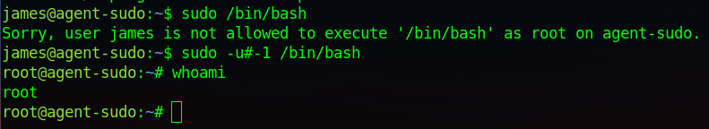

# TryHackMe: Agent Sudo

## Task 1: Author note
### Question 1: Deploy the machine - :heavy\_check_mark:


## Task 2: Enumerate
Используем nmap для сканирования машины:
```sh
nmap -sC -sV 10.10.240.122
```


Мы нашли:
- 21 port - FTP (vsftpd 3.0.3)
- 22 port - SSH (OpenSSH 7.6p1)
- 80 port - HTTP (Apache httpd 2.4.29)

### Question 2: How many open ports? - 3

Далее переходим на сайт:


### Question 3: How you redirect yourself to a secret page? - user-agent

Судя по всему, нам необходимо подставить правильную букву агента в поле User-agent, чтобы получить доступ к сайту. Процесс перебора правильной буквы (символа агента):


Находим букву С, подставляем ее в поле User-agent:  


В итоге переходим на некую страницу-предупреждение:


### Question 4: What is the agent name? - chris


## Task 3: Hash cracking and brute-force 
Теперь мы знаем имя агента - chris. Попробуем перебрать пароль этого пользователя на FTP-сервере:

```sh
hydra -l chris -P /usr/share/wordlists/rockyou.txt ftp://10.10.240.122
```


### Question 5: FTP password - crystal

Пароль получен, перейдем на FTP-сервер и посмортрим содержимое


Скачиваем файлы:


Проанализируем базовыми инструментами найденные файлы:


В сообщении сказано, что пароль скрыт внутри какой-то из картинок. Попробуем найти и извлечь:


Вот и нашли что-то интересное - текстовый файл в картинке. Извлекаем:


Самое интересное, что извлеченный ZIP-архив под паролем. Получим хэш и сбрутим пароль от архива:


### Question 6: Zip file password - alien

Получив пароль, проверим содержимое:


Обращаем внимание на сообщение в кавычках. Похоже на Base64, попробуем декодировать:


### Question 7: steg password - Area51

Извлекаем данные из второй картинки, используя найденный пароль:


### Question 8: Who is the other agent (in full name)? - james

### Question 9: Deploy the machine - SSH password - hackerrules!


## Task 4: Capture the user flag
Подключаемся по SSH от лица пользователя **james** с паролем **hackerrules!**:


Найденный user-флаг:


### Question 10: What is the user flag? - b03d975e8c92a7c04146cfa7a5a313c7
### Question 11: What is the incident of the photo called? - Roswell alien autopsy


## Task 5: Privilage escalation
Посмотрим, какими sudo-правами мы обладаем:


После долгих различных попыток повысить привилегии, удалось найти следующее - уязвимость в sudo:


Уязвимость на ExploitDB:


Реализуем:




### Question 12: CVE number for the escalation - CVE-2019-14287
### Question 13: What is the root flag? - b53a02f55b57d4439e3341834d70c062
### Question 14: (Bonus) Who is Agent R? - DesKel
