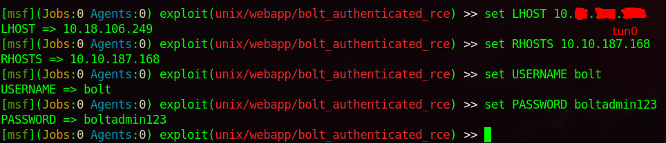

# TryHackMe: Bolt


## Task 1 Deploy the machine
### Question 1: Start the machine - :heavy\_check_mark:


## Task 2: Hack your way into the machine! 
Используем nmap для сканирования машины:
```sh
nmap -sC -sV 10.10.187.168
```


Мы нашли:
- 22 port - SSH (OpenSSH 7.6p1)
- 80 port - HTTP (Apache httpd 2.4.29)
- 8000 port - HTTP (PHP 7.2.32-1)

Посмотрим оба сайта на портах 80 и 8000:


На порте 8000 находим полноценный сайт.

## Question 2: What port number has a web server with a CMS running? - 8000

Самое интересное, что в сообщениях находятся логин и пароль:


## Question 3: What is the username we can find in the CMS? - bolt

## Question 4: What is the password we can find for the username? - boltadmin123

Зная логин и пароль (***bolt:boltadmin123***), попробуем авторизоваться. Вот только как, если кнопки авторизации нигде нет? Нужно найти директорию, но перебирать мы их не будем. Попробуем найти необходимую информацию в Интернете:


Чтобы перейти к форме логина, необходимо в URL-адрес добавить ***/bolt***.


Входим:


Внизу сайта находится информация о версии сайта:


## Question 5: What version of the CMS is installed on the server? (Ex: Name 1.1.1) - bolt 3.7.1

Находим эксплойт на Exploit DB:


## Question 6: There's an exploit for a previous version of this CMS, which allows authenticated RCE. Find it on Exploit DB. What's its EDB-ID? - 48296

Запускаем Metasploit Framework и пробуем найти нужный нам эксплойт:


Посмотрим настройки:


## Question 7: Metasploit recently added an exploit module for this vulnerability. What's the full path for this exploit? (Ex: exploit/....) - exploit/unix/webapp/bolt_authenticated_rce/

Установим правильные настройки и запустим:




## Question 8: Set the LHOST, LPORT, RHOST, USERNAME, PASSWORD in msfconsole before running the exploit - - :heavy\_check_mark:

Находим флаг:


## Question 9: Look for flag.txt inside the machine. - THM{wh0_d035nt_l0ve5_b0l7_r1gh7?}
