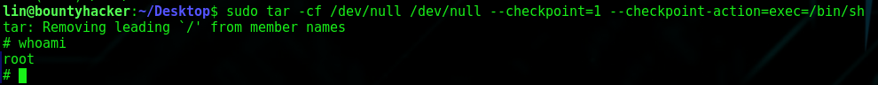

# TryHackMe: Bounty Hacker

## Task 1: Living up to the title
### Question 1: Find open ports on the machine
Используем nmap для сканирования машины:
```sh
nmap -sC -sV 10.10.241.85
```


Найденные порты:
- 21 port - FTP (vsftpd 3.0.3)
- 22 port - SSH (OpenSSH 7.2p2)
- 80 port - HTTP (Apache httpd 2.4.18)

### Question 2: Who wrote the task list?
Попробуем зайти на сайт, который находится на 80 порте машины.


К сожалению, ничего существенного не находим, поэтому пробуем найти скрытые директории, при помощи инструмента *dirbuster*


В итоге находим директорию */images/*, если перейти по этому пути, можно обнаружить список файлов, находящихся на веб-сервере.


Далее, попробуем зайти на FTP-сервер под анонимом и у нас это получается:


В таком случае, посмотрим на список файлов:


Мы нашли 2 txt-файла. Сразу скачиваем их и смотрим:


- task.txt - план каких-то действий, а также имя автора - lin
- locks.txt - по всей видимости пароли

### Question 3: What service can you bruteforce with the text file found?

Имея пароль и логин, мы могли бы попытаться войти по ssh, но правильного пароля у нас нет, поэтому при помощи инструмента *hydra*, сделаем перебор паролей:
```sh
hydra -l lin -P locks.txt 10.10.241.85 ssh
```


### Question 4: What is the users password?
При помощи инструмент *hydra* нам удается найти пароль - ***RedDr4gonSynd1cat3***

### Question 5: user.txt
Теперь, имея логин и пароль, попробуем подключиться по ssh:


Просматриваем файлы в текущей директории, тем самым находим один из нужных нам файлов *user.txt*. Читаем его:


### Question 6: root.txt
Следующим этапом запустим соответствующую команду, чтобы узнать, что рядовой пользователь может делать наряду с суперпользователем:
```sh
sudo -l
```


Видим, что нам доступен tar (утилита tar предназначена для создания архивов файлов и каталогов). Находим на GTFORBins раздел с tar. Нам нужна графа *Sudo*:


Применяем найденную команду, а также проверяем, кем мы являемся:
```sh
sudo tar -cf /dev/null /dev/null --checkpoint=1 --checkpoint-action=exec=/bin/sh
```


Перемещаемся в директорию */root*, где находим второй нужный нам файл, а в нем и заключительный флаг суперпользователя:


