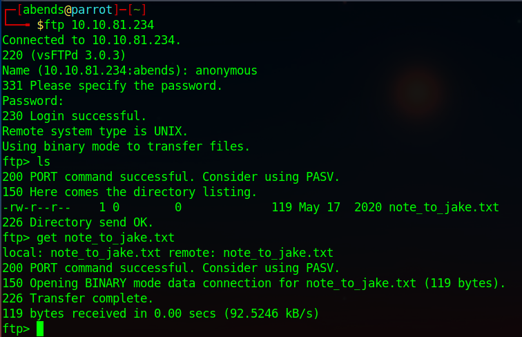

# TryHackMe: Brooklyn Nine Nine

## Task 1: Deploy and get hacking 
Используем nmap для сканирования машины:
```sh
nmap -sC -sV 10.10.81.234
```


Мы нашли:
- 21 port - FTP (vsftpd 3.0.3)
- 22 port - SSH (OpenSSH 7.6p1)
- 80 port - HTTP (Apache httpd 2.4.29)

Осмотрим сайт:


К сожалению, нас сайте нет ничего, кроме картинки, поэтому проверим файл на FTP-сервере:




В сообщении сказано, что у **jake** слабый пароль, который ему советуют поменять. Попробуем сбрутить пароль при помощи инструмента hydra. Брутить будем относительно SSH:


В итоге, получаем следующие данные для подключения по SSH - **jake:987654321**:


Ищем user-флаг:


### Question 1: User flag - ee11cbb19052e40b07aac0ca060c23ee

Наши права на sudo:


Нам доступная утилита **less**. Посмотрим, можно ли с ее помощью получить root'а:


Следуем способу выше:


Как итог, повышаем привилегии и находим финальный флаг:


### Question 2: Root flag - 63a9f0ea7bb98050796b649e85481845
