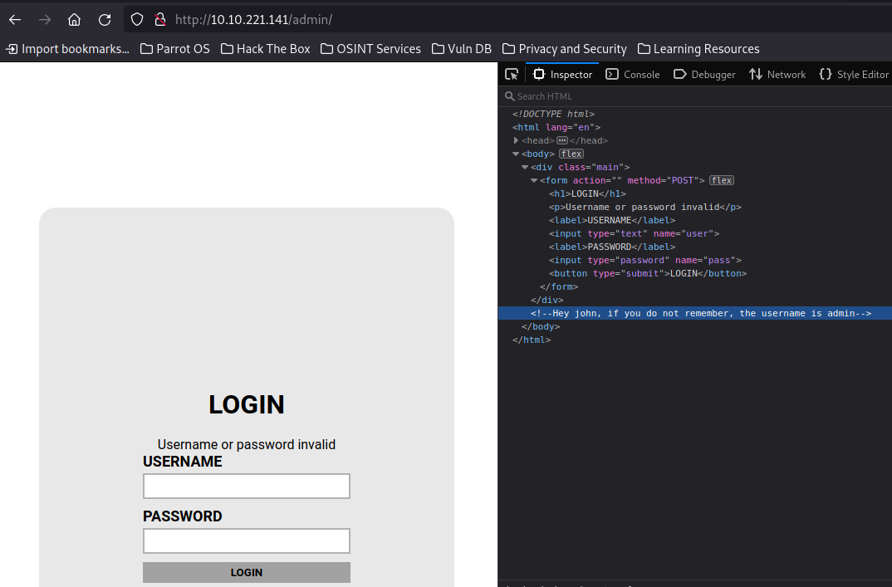

# TryHackMe: Brute It

## Task 1: About this box
### Question 1: Deploy the machine - :heavy\_check_mark:

## Task 2: Reconnaissance
Используем nmap для сканирования машины:
```sh
nmap -sC -sV 10.10.221.141
```


Мы нашли:
- 22 port - SSH (OpenSSH 7.6p1)
- 80 port - HTTP (Apache httpd 2.4.29)

### Question 2: Search for open ports using nmap. How many ports are open? - 2
### Question 3: What version of SSH is running? - OpenSSH 7.6p1
### Question 4: What version of Apache is running? - 2.4.29
### Question 5: Which Linux distribution is running? - Ubuntu

Перейдем на сайт:


Видим, что при переходе появляется Apache Default Page. Попробуем найти другие директории:

```sh
gobuster dir -u http://10.10.221.141/ -w /usr/share/wordlists/dirbuster/directory-list-2.3-medium.txt
```


Находим директорию **/admin**.

### Question 6: Search for hidden directories on web server. What is the hidden directory? - /admin


## Task 3: Getting a shell
Переместимся по найденной директории и найдем форму логина:



В инспекторе видно, что логин - **admin**.  Попробуем перебрать пароль:
```sh
hydra -l admin -P /usr/share/wordlists/rockyou.txt 10.10.221.141 http-post-form "/admin/index.php:user=^USER^&pass=^PASS^:invalid"
```


### Question 7: What is the user:password of the admin panel? - admin:xavier

В итоге пароль найден, вход произведен, мы нашли приватный ключ RSA и первый флаг:


Переместив приватный ключ в отдельный файл, получим хэш:


Переберем пароль и установим нужные права:


### Question 8: Crack the RSA key you found. What is John's RSA Private Key passphrase? - rockinroll

В итоге входим по SSH на хост:


Находим первый флаг:


### Question 9: user.txt - THM{a_password_is_not_a_barrier}
### Question 10: Web flag - THM{brut3_f0rce_is_e4sy}


## Task 4: Privilege Escalation
Далее посмотрим, что мы можем делать относительно sudo:


Видим, что нам доступна утилита **cat**. В таком случае, посмотрим хэш пароля от пользователя root в файле **/etc/shadow**:


Перенесем в отдельный файл:


Перебираем пароль:


Забираем root-флаг:


### Question 11: Find a form to escalate your privileges. What is the root's password? - football
### Question 12: root.txt - THM{pr1v1l3g3_3sc4l4t10n}
