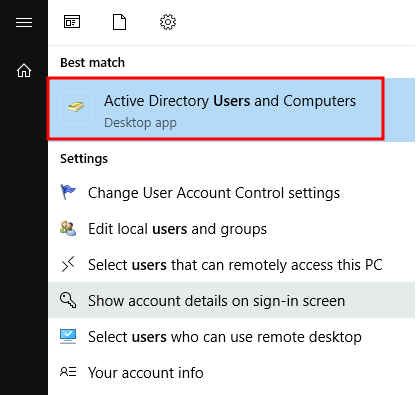
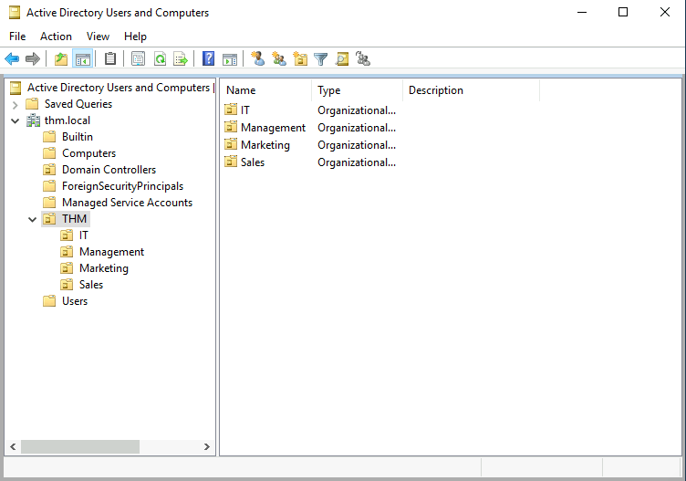
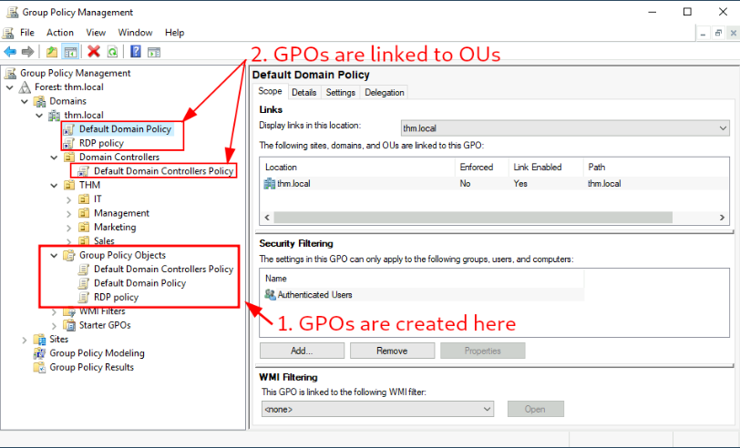

# TryHackMe: Active Directory Basics

---

## Task 1: Introduction

**Active Directory (AD)** — это проприетарная реализация службы каталогов, которая используется в операционных системах компании Microsoft. Решение представляет собой централизованную базу данных, которая хранит информацию о пользователях, группах, компьютерах и других ресурсах в сети.

---

## Task 2: Windows Domains

Представим ситуацию, когда наш офис насчитывает всего 5 сотрудников, а также 5-7 рабочих мест, включая отдлельные сервера. В таком случае, администрирование такого количества АРМ и серверов - задача достаточно тривиальная, но что делать, если офис (или даже не один) насчитывает более 100 сотрудников и большие количество серверов? Согласитесь, администрирование в таком случае - задача крайне сложная. Гораздо проще производить все операции централизовано.

Для подобных целей и существует **домен**, который агрегирует в себе пользователей, их компьютеры, а также различные политики (об этом далее). **Репозиторий**, в котором содержится вышеупомянутая информация, называется **Active Directory (AD)**, а сервер, на котором расположен этот репозиторий - **контроллер домена (Domain Controller (DC))**. Пример:


Отсюда и основные преимущества AD:
- Централизованное управление ресурсами компании
- Управление политиками

Далее мы будем работать с контретной инфраструктурой. Для этого необходимо включить OpenVPN конфиг и перейти к подключению по RDP. Данные для входа:

- THM.local
- Username: THM\Administrator
- Password: Password321

**Question 1:** In a Windows domain, credentials are stored in a centralised repository called... - **Active Directory**

**Question 2:** The server in charge of running the Active Directory services is called... - **Domain Controller**

---

## Task 3: Active Directory

Ядром контроллера домена на основе ОС Windows является служба **Active Directory Domain Services (AD DS)**. Как уже говорилось ранее, это каталог (репозиторий), который может содержать в себе множество объектов - users, groups, machines, printers, shares и др.

- ***Users*** - пользователи являются одним из объектов, известных как участники безопасности, что означает, что они могут проходить проверку подлинности в домене и им могут быть назначены привилегии на такие ресурсы, как файлы или принтеры. Вы могли бы сказать, что участник безопасности - это объект, который может воздействовать на ресурсы в сети. При этом это могут быть как пользователи, так и сервисы.
- ***Machines*** - это все компьютеры, который подключаются к контроллеру домена.
- ***Security Groups*** - сущность, которая агрегирует в себя множество пользователей/компьютеров, а также разграничивает права на использование ресурсов сети.

Наиболее важные группы внутри контроллера домена:

|Группа|Описание|
|:-------:|:------:|
|Domain Admins|Users of this group have administrative privileges over the entire domain. By default, they can administer any computer on the domain, including the DCs.|
|Server Operators|Users in this group can administer Domain Controllers. They cannot change any administrative group memberships.|
|Backup Operators|Users in this group are allowed to access any file, ignoring their permissions. They are used to perform backups of data on computers.|
|Account Operators|Users in this group can create or modify other accounts in the domain.|
|Domain Users|Includes all existing user accounts in the domain.|
|Domain Computers|Includes all existing computers in the domain.|
|Domain Controllers|Includes all existing DCs on the domain.|

#### Active Directory Users and Computers

Для конфигурирования пользователей, групп и компьютеров в Active Directory, необходимо авторизоваться в контроллере домена и перейти во вкладку "Active Directory Users and Computers":



Когда мы зашли в вышеупомянутый раздел, перед нами пояалется иерархия домена **thm.local**:



Основа здесь - условные папки, которые имеют своё собственное определение - Подразделения **Organizational Units (OUs)**. Непосредственно внутри уже находятся объекты - пользователи, компьютеры и прочие. При этом получается, что подразделения в основном используются для определения групп пользователей со схожими требованиями к политикам (в том числе и политики безопасности). При этом я уже упомянул слово иерархия. Соответственно, подразделения IT, Management, Marketing, Research and Development и Sales являются дочерними подразделениями юнита THM. Создадим тестовое подразделение в THM под названием Students:


Также можно заглянуть внутрь подразделений и увидеть пользователей:


Компьютеры:


Идентифицировать учетные записи машин достаточно легко. Они следуют определенной схеме именования. Имя УЗ компьютера - это имя компьютера, за которым следует знак доллара ($). Например, машина с именем DC01 будет иметь УЗ компьютера с именем DC01$. 

Вы, наверное, уже заметили, что помимо THM OU существуют и другие контейнеры по умолчанию. Эти контейнеры создаются Windows автоматически и содержат следующее:

**Builtin**: Содержит группы по умолчанию, доступные для любого узла Windows.
**Computers**: По умолчанию сюда будет помещен любой компьютер, подключенный к сети. Вы можете переместить их при необходимости.
**Domain Controllers**: Подразделение по умолчанию, содержащее контроллеры домена в вашей сети.
**Users**: Пользователи и группы по умолчанию, которые применяются к контексту всего домена.
**Managed Service Accounts**: Содержит учетные записи, используемые службами в вашем домене Windows.

#### Security Groups vs OUs

Вам, вероятно, интересно, почему у нас есть как группы, так и подразделения. Хотя и те, и другие используются для классификации пользователей и компьютеров, их цели совершенно разные:

Подразделения удобны для применения политик к пользователям и компьютерам, которые включают конкретные конфигурации, относящиеся к наборам пользователей в зависимости от их конкретной роли на предприятии. Помните, что пользователь может быть одновременно членом только одного подразделения, поскольку было бы бессмысленно пытаться применить два разных набора политик к одному пользователю. 

Группы безопасности, с другой стороны, используются для предоставления разрешений на доступ к ресурсам. Например, вы будете использовать группы, если хотите разрешить некоторым пользователям доступ к общей папке или сетевому принтеру. Пользователь может быть частью многих групп, что необходимо для предоставления доступа к нескольким ресурсам.

**Question 3:** Which group normally administrates all computers and resources in a domain? - Domain Admins
**Question 4:** What would be the name of the machine account associated with a machine named TOM-PC? - TOM-PC$
**Question 5:** Suppose our company creates a new department for Quality Assurance. What type of containers should we use to group all Quality Assurance users so that policies can be applied consistently to them? - Organizational Units

---

## Task 4: Managing Users in AD

Теперь представим, что у нас есть следующая схема, на которую необходимо ориентироваться для дальнейшего продвижения в данной комнате:


#### Deleting extra OUs and users

По умолчанию, все подразделения в AD защищены от прямого удаления, т.е., если мы попытаемся сейчас удалить какой-либо юнит, то получим ошибку:


Чтобы это исправить, нужно зайти в раздел "Advanced Features" в "View" меню:


Далее перейти в раздел "Object" и убрать галочку с параметра защиты контейнера:


Теперь мы можем успешно удалить подразделение:


#### Delegation

Одна из хороших вещей, которую вы можете сделать в AD, — это предоставить конкретным пользователям некоторый контроль над некоторыми подразделениями. Этот процесс известен как делегирование и позволяет предоставлять пользователям определенные привилегии для выполнения сложных задач в подразделениях без вмешательства администратора домена.

Одним из наиболее распространенных вариантов использования этого является предоставление ИТ-поддержке привилегий для сброса паролей других пользователей с низким уровнем привилегий. Согласно нашей организационной структуре, Филипп отвечает за ИТ-поддержку, поэтому мы, вероятно, хотели бы делегировать ему контроль над сбросом паролей в подразделениях продаж, маркетинга и управления.

В этом примере мы делегируем Филиппу контроль над подразделением продаж. Чтобы делегировать контроль над подразделением, вы можете щелкнуть его правой кнопкой мыши и выбрать «Делегировать управление»:


Нажмите «Далее» пару раз, и теперь Phillip сможет сбросить пароли для любого пользователя в отделе продаж. Хотя вы, вероятно, захотите повторить эти шаги, чтобы делегировать сброс паролей отделов маркетинга и управления, мы оставим это здесь для этой задачи. При желании вы можете продолжить настройку остальных подразделений.

Теперь давайте воспользуемся учетной записью Филиппа, чтобы попытаться сбросить пароль Sophie. Вот учетные данные Филиппа для входа в систему через RDP:


Применяем необходимые правила:


Заходим на аккаунт Sophie и у нас сразу просят сменить пароль, что и должно быть:


Читаем флаг:


**Question 6:** What was the flag found on Sophie's desktop? - THM{thanks_for_contacting_support}
**Question 7:** The process of granting privileges to a user over some OU or other AD Object is called... - delegation

---

## Task 5: Managing Computers in AD

По умолчанию все машины, присоединяющиеся к домену (за исключением контроллеров домена), будут помещены в контейнер под названием "Компьютеры". Если мы проверим наш DC, то увидим, что некоторые устройства уже есть:


Мы можем видеть некоторые серверы, некоторые ноутбуки и некоторые ПК, соответствующие пользователям в нашей сети. Наличие там всех наших устройств - не самая лучшая идея, поскольку очень вероятно, что вам нужны разные политики для ваших серверов и машин, которыми обычные пользователи пользуются ежедневно.

Хотя не существует золотого правила организации ваших машин, отличной отправной точкой является разделение устройств в соответствии с их использованием. В целом, вы ожидали бы увидеть устройства, разделенные, по крайней мере, на три следующие категории:

1. Workstations
2. Servers
3. Domain Controllers

Поскольку мы приводим в порядок наш AD, давайте создадим два отдельных подразделения для рабочих станций и серверов (контроллеры домена уже находятся в подразделении, созданном Windows). Мы будем создавать их непосредственно в контейнере домена **thm.local**. В итоге у вас должна получиться следующая структура подразделения:


Теперь переместим персональные компьютеры и ноутбуки в подразделение "Рабочие станции", а серверы - в подразделение "Серверы" из контейнера "Компьютеры". Это позволит нам позже настроить политики для каждого подразделения.

**Question 8:** After organising the available computers, how many ended up in the Workstations OU? - 7
**Question 9:** Is it recommendable to create separate OUs for Servers and Workstations? (yay/nay) - yay

---

## Task 6: Group Policies

До сих пор мы организовывали пользователей и компьютеры в подразделениях просто ради этого, но основная идея, стоящая за этим, заключается в том, чтобы иметь возможность развертывать различные политики для каждого подразделения в отдельности. Таким образом, мы можем предоставлять пользователям различные конфигурации и базовые показатели безопасности в зависимости от их отдела.

Windows управляет такими политиками с помощью объектов групповой политики **Group Policy Objects (GPO)**. Объекты групповой политики - это просто набор параметров, которые могут быть применены к подразделениям. Объекты групповой политики могут содержать политики, предназначенные как для пользователей, так и для компьютеров, что позволяет устанавливать базовые параметры для конкретных компьютеров и удостоверений.

Для настройки объектов групповой политики вы можете воспользоваться средством управления групповой политикой, доступным в меню Пуск:


Первое, что вы увидите, открыв его, - это полная иерархия вашего подразделения, как определено ранее. Чтобы настроить групповые политики, вы сначала создаете объект групповой политики в разделе Объекты групповой политики, а затем связываете его с подразделением, в котором вы хотите применить политики. В качестве примера вы можете видеть, что на вашем компьютере уже есть несколько объектов групповой политики:



На изображении выше мы можем видеть, что было создано 3 объекта групповой политики. Из них политика домена по умолчанию **(Default Domain Policy)** и политика RDP **(RDP Policy)** связаны с доменом **thm.local** в целом, а политика контроллеров домена по умолчанию **(Default Domain Controllers Policy)** связана только с подразделением контроллеров домена **(Domain Controllers)**. Важно иметь в виду, что любой объект групповой политики будет применяться к связанному подразделению и любым подразделениям под ним. Например, на подразделение продаж **(Sales)** по-прежнему будет влиять политика домена по умолчанию **(Default Domain Policy)**.

Давайте изучим политику домена по умолчанию **(Default Domain Policy)**, чтобы увидеть, что находится внутри объекта групповой политики. Первая вкладка, которую вы увидите при выборе объекта групповой политики, показывает его область действия, на которую ссылается объект групповой политики в объявлении. Что касается текущей политики, мы можем видеть, что она была связана только с доменом **thm.local**:


Как вы можете видеть, вы также можете применить фильтрацию безопасности к объектам групповой политики, чтобы они применялись только к определенным пользователям/компьютерам в подразделении. По умолчанию они будут применяться к группе аутентифицированных пользователей, которая включает всех пользователей/ПК.

Вкладка "Settings" содержит фактическое содержимое объекта групповой политики и позволяет нам узнать, какие конкретные конфигурации она применяет. Как указывалось ранее, у каждого объекта групповой политики есть конфигурации, которые применяются только к компьютерам, и конфигурации, которые применяются только к пользователям. В этом случае политика домена по умолчанию **(Default Domain Policy)** содержит только конфигурации компьютера:


Не стесняйтесь изучать объект групповой политики и расширять список доступных элементов, используя ссылки "показать" справа от каждой конфигурации. В этом случае политика домена по умолчанию **(Default Domain Policy)** указывает действительно базовые конфигурации, которые должны применяться к большинству доменов, включая политики блокировки паролей и учетных записей:


Поскольку этот объект групповой политики применяется ко всему домену, любое его изменение затронет все компьютеры. Давайте изменим политику минимальной длины пароля, чтобы требовать от пользователей, чтобы их пароли содержали не менее 10 символов. Для этого щелкните объект групповой политики правой кнопкой мыши и выберите **Edit**:


Откроется новое окно, в котором мы сможем перемещаться и редактировать все доступные конфигурации. Чтобы изменить минимальную длину пароля, перейдите на:

```sh
Computer Configurations -> Policies -> Windows Setting -> Security Settings -> Account Policies -> Password Policy
```

и измените требуемое значение политики:


Как вы можете видеть, в объекте групповой политики может быть установлено множество политик. Хотя объяснить все до единого из них было бы невозможно в одной комнате, не стесняйтесь немного ознакомиться с ними, поскольку некоторые правила просты. Если требуется дополнительная информация о какой-либо из политик, вы можете дважды щелкнуть по ним и прочитать вкладку "Explain" для каждой из них:


#### GPO distribution

Объекты групповой политики распространяются по сети через общий сетевой ресурс под названием **SYSVOL**, который хранится в контроллере домена. Все пользователи в домене, как правило, должны иметь доступ к этому общему ресурсу по сети, чтобы периодически синхронизировать свои объекты групповой политики. Общий доступ SYSVOL по умолчанию указывает на каталог `C:\Windows\SYSVOL\sysvol\` на каждом из контроллеров домена в нашей сети.

После внесения изменений в какие-либо объекты групповой политики компьютерам может потребоваться до 2 часов, чтобы наверстать упущенное. Если вы хотите заставить какой-либо конкретный компьютер немедленно синхронизировать свои объекты групповой политики, вы всегда можете запустить следующую команду на нужном компьютере:

```sh
PS C:\> gpupdate /force
```

#### Creating some GPOs for THM Inc.

В рамках нашей новой работы нам было поручено внедрить некоторые объекты групповой политики, которые позволят нам:

1. Блокировать доступ пользователей, не связанных с ИТ, к панели управления.
2. Заставить рабочие станции и серверы автоматически блокировать экран после 5 минут бездействия пользователя, чтобы люди не оставляли свои сеансы незащищенными.

Давайте сосредоточимся на каждом из них и определим, какие политики мы должны включить в каждом объекте групповой политики и где они должны быть связаны.

##### Restrict Access to Control Panel

Мы хотим ограничить доступ к панели управления на всех компьютерах только для пользователей, которые являются частью ИТ-отдела. Пользователи других отделов не должны иметь возможности изменять настройки системы.

Давайте создадим новый объект групповой политики под названием **Restrict Control Panel Access** и откроем его для редактирования. Поскольку мы хотим, чтобы этот объект групповой политики применялся к конкретным пользователям, мы рассмотрим в разделе **User Configuration** следующую политику:


Обратите внимание, что мы включили политику запрета доступа к панели управления и настройкам ПК.

Как только объект групповой политики будет настроен, нам нужно будет связать его со всеми подразделениями, соответствующими пользователям, которые не должны иметь доступа к панели управления своих ПК. В этом случае мы свяжем подразделения маркетинга, управления и продаж, перетащив объект групповой политики к каждому из них:


##### Auto Lock Screen GPO

Для первого объекта групповой политики, касающегося блокировки экрана для рабочих станций и серверов, мы могли бы напрямую применить его к рабочим станциям, серверам и контроллерам домена, которые мы создали ранее.

Хотя это решение должно сработать, альтернативой является простое применение объекта групповой политики к корневому домену, поскольку мы хотим, чтобы объект групповой политики влиял на все наши компьютеры. Поскольку все подразделения рабочих станций, серверов и контроллеров домена являются дочерними подразделениями корневого домена, они унаследуют его политики.

> Примечание: Вы можете заметить, что если наш объект групповой политики применяется к корневому домену, он также будет унаследован другими подразделениями, такими как отдел продаж или маркетинга. Поскольку эти подразделения содержат только пользователей, любая конфигурация компьютера в нашем объекте групповой политики будет ими проигнорирована.

Давайте создадим новый объект групповой политики, назовем его **Auto Lock Screen** и отредактируем его. Политика достижения того, чего мы хотим, изложена в следующем маршруте:


Мы установим ограничение на неактивность в 5 минут, чтобы компьютеры автоматически блокировались, если какой-либо пользователь оставит свою сессию открытой. После закрытия редактора объектов групповой политики мы свяжем объект групповой политики с корневым доменом, перетащив на него объект групповой политики:


**Question 10**: What is the name of the network share used to distribute GPOs to domain machines? - sysvol
**Question 11**: Can a GPO be used to apply settings to users and computers? (yay/nay) - yay

---

## Task 7: Authentication Methods

При использовании доменов Windows все учетные данные хранятся в контроллерах домена. Всякий раз, когда пользователь пытается пройти аутентификацию в службе с использованием учетных данных домена, службе необходимо запросить у контроллера домена подтверждение их правильности. Для сетевой аутентификации в доменах Windows можно использовать два протокола:

**Kerberos**: Используется любой последней версией Windows. Это протокол по умолчанию в любом новом домене.
**NetNTLM**: Устаревший протокол аутентификации, сохраненный в целях совместимости.

Хотя NetNTLM следует считать устаревшим, в большинстве сетей будут включены оба протокола. Давайте более подробно рассмотрим, как работает каждый из этих протоколов.

#### Kerberos Authentication

Аутентификация Kerberos является протоколом аутентификации по умолчанию для любой последней версии Windows. Пользователям, которые входят в службу с помощью Kerberos, будут назначены тикеты. Думайте о тикетах как о доказательстве предыдущей аутентификации. Пользователи, у которых есть билеты, могут предъявить их службе, чтобы продемонстрировать, что они уже проходили аутентификацию в сети ранее и, следовательно, имеют возможность ее использовать.

Когда для аутентификации используется Kerberos, происходит следующий процесс:

1. Пользователь отправляет свое имя пользователя и временную метку, зашифрованные с использованием ключа, полученного из его пароля, в **Key Distribution Center (KDC)**, службу, обычно устанавливаемую на контроллере домена, отвечающую за создание заявок Kerberos в сети. 

KDC создаст и отправит обратно **Ticket Granting Ticket (TGT)**, которая позволит пользователю запросить дополнительные билеты для доступа к определенным сервисам. Необходимость в билете для получения большего количества билетов может показаться немного странной, но это позволяет пользователям запрашивать билеты на обслуживание, не передавая свои учетные данные каждый раз, когда они хотят подключиться к сервису. Вместе с TGT пользователю выдается сеансовый ключ **(Session Key)**, который ему понадобится для генерации следующих запросов. 

Обратите внимание, что TGT зашифрован с использованием хэша пароля учетной записи **krbtgt**, и поэтому пользователь не может получить доступ к его содержимому. Важно знать, что зашифрованный TGT включает копию сеансового ключа как часть своего содержимого, и KDC нет необходимости хранить сеансовый ключ, поскольку при необходимости он может восстановить копию, расшифровав TGT.


2. Когда пользователь хочет подключиться к службе в сети, такой как общий ресурс, веб-сайт или база данных, он будет использовать свой TGT, чтобы запросить у KDC - **Ticket Granting Service (TGS)**. TGS - это билеты, которые разрешают подключение только к конкретной службе, для которой они были созданы. Чтобы запросить TGS, пользователь отправит свое имя пользователя и временную метку, зашифрованные с использованием сеансового ключа, вместе с TGT и **Service Principal Name (SPN)**, которое указывает имя службы и сервера, к которым мы намерены получить доступ. 

В результате KDC отправит нам TGS вместе с ключом сеанса службы, который нам понадобится для аутентификации в службе, к которой мы хотим получить доступ. TGS зашифрован с использованием ключа, полученного из хэша владельца службы. Владельцем службы является учетная запись пользователя или компьютера, под которой выполняется служба. TGS содержит копию ключа сеанса службы в зашифрованном содержимом, чтобы владелец Службы мог получить к нему доступ, расшифровав TGS.


3. Затем TGS можно отправить в нужную службу для аутентификации и установления соединения. Служба будет использовать хэш пароля своей настроенной учетной записи для расшифровки TGS и проверки ключа сеанса службы.


#### NetNTLM Authentication

NetNTLM работает с использованием механизма "вызов-ответ". Весь процесс выглядит следующим образом:


1. Клиент отправляет запрос на аутентификацию серверу, к которому он хочет получить доступ.
2. Сервер генерирует случайное число и отправляет его клиенту в качестве запроса.
3. Клиент объединяет свой хэш пароля NTLM с запросом (и другими известными данными), чтобы сгенерировать ответ на запрос и отправить его обратно на сервер для проверки.
4. Сервер пересылает запрос и ответ контроллеру домена для проверки.
5. Контроллер домена использует запрос для повторного вычисления ответа и сравнивает его с исходным ответом, отправленным клиентом. Если они оба совпадают, клиент аутентифицируется; в противном случае доступ запрещен. Результат аутентификации отправляется обратно на сервер.
6. Сервер пересылает результат аутентификации клиенту.

> Обратите внимание, что пароль пользователя (или хэш) никогда не передается по сети в целях безопасности.

> Примечание: Описанный процесс применяется при использовании учетной записи домена. Если используется локальная учетная запись, сервер может сам проверить ответ на запрос, не требуя взаимодействия с контроллером домена, поскольку хэш пароля хранится локально на его SAM.

**Question 12**: Will a current version of Windows use NetNTLM as the preferred authentication protocol by default? (yay/nay) - nay
**Question 13**: When referring to Kerberos, what type of ticket allows us to request further tickets known as TGS? - Ticket Granting Ticket
**Question 14**: When using NetNTLM, is a user's password transmitted over the network at any point? (yay/nay) - nay

---

## Task 8: Trees, Forests and Trusts

До сих пор мы обсуждали, как управлять одним доменом, роль контроллера домена и как он объединяет компьютеры, серверы и пользователей.


По мере роста компаний растут и их сети. Наличие одного домена для компании достаточно хорошо для начала, но со временем некоторые дополнительные потребности могут подтолкнуть вас к созданию нескольких доменов.

#### Trees

Представьте, например, что внезапно ваша компания расширяется в новую страну. В новой стране действуют другие законы и нормативные акты, которые требуют, чтобы вы обновили свои объекты групповой политики в соответствии с ними. Кроме того, теперь у вас есть ИТ-специалисты в обеих странах, и каждая ИТ-команда должна управлять ресурсами, соответствующими каждой стране, не вмешиваясь в работу другой команды. Хотя вы могли бы создать сложную структуру подразделения и использовать делегирование для достижения этой цели, огромной структурой AD может быть трудно управлять и она подвержена человеческим ошибкам. Возникает проблема - систематизации ресурсов и их нагроможденность.

К счастью для нас, Active Directory поддерживает интеграцию нескольких доменов, так что вы можете разделить свою сеть на блоки, которыми можно управлять независимо. Если у вас есть два домена, которые используют одно и то же пространство имен (thm.local в нашем примере), эти домены можно объединить в дерево.

Если бы наш домен **thm.local** был разделен на два поддомена для филиалов в Великобритании и США, вы могли бы построить дерево с корневым доменом **thm.local** и двумя поддоменами с именами **uk.thm.local** и **us.thm.local**, каждый со своей AD, компьютерами и пользователями:


Эта секционированная структура дает нам лучший контроль над тем, кто может получить доступ к чему-либо в домене. У ИТ-специалистов из Великобритании будет свой собственный центр управления, который будет управлять ресурсами только в Великобритании. Например, пользователь из Великобритании не смог бы управлять пользователями из США. Таким образом, администраторы домена каждого филиала будут иметь полный контроль над своими соответствующими контроллерами домена, но не над контроллерами домена других филиалов. Политики также могут быть настроены независимо для каждого домена в дереве.

Когда речь заходит о деревьях и лесах, необходимо ввести новую группу безопасности. Группа администраторов предприятия предоставит пользователю административные привилегии во всех доменах предприятия. У каждого домена по-прежнему будут свои администраторы домена с правами администратора над их отдельными доменами и администраторы предприятия, которые могут контролировать все на предприятии.

#### Forests

Домены, которыми вы управляете, также могут быть настроены в разных пространствах имен. Предположим, ваша компания продолжает расти и в конечном итоге приобретает другую компанию под названием MHT Inc. Когда обе компании объединятся, у вас, вероятно, будут разные доменные деревья для каждой компании, каждая из которых будет управляться своим собственным ИТ-отделом. Объединение нескольких деревьев с разными пространствами имен в одну сеть называется лесом.


#### Trust Relationships

Наличие нескольких доменов, организованных в виде деревьев и лесов, позволяет вам создать хорошую разделенную сеть с точки зрения управления и ресурсов. Но в определенный момент пользователю THM UK может потребоваться доступ к общему файлу на одном из серверов MHT ASIA. Чтобы это произошло, домены, расположенные в деревьях и лесах, соединяются доверительными отношениями.

Проще говоря, наличие доверительных отношений между доменами позволяет вам авторизовать пользователя из домена THM UK для доступа к ресурсам из домена MHT EU. Самые простые доверительные отношения, которые могут быть установлены, - это односторонние доверительные отношения. При одностороннем доверии, если домен AAA доверяет домену BBB, это означает, что пользователь на BBB может быть авторизован для доступа к ресурсам на AAA:


Направление односторонних доверительных отношений противоположно направлению доступа. Также могут быть установлены двусторонние доверительные отношения, позволяющие обоим доменам взаимно авторизовывать пользователей друг из друга. По умолчанию объединение нескольких доменов в дерево или лес формирует двусторонние доверительные отношения.

Важно отметить, что наличие доверительных отношений между доменами не означает автоматического предоставления доступа ко всем ресурсам в других доменах. Как только доверительные отношения установлены, у вас есть возможность авторизовывать пользователей в разных доменах, но вам решать, что на самом деле авторизовано, а что нет.

**Question 15** - What is a group of Windows domains that share the same namespace called? - Tree
**Question 16** - What should be configured between two domains for a user in Domain A to access a resource in Domain B? - A Trust Relationship

---

## Task 9: Conclusion

В этой комнате мы показали основные компоненты и концепции, связанные с Active Directories и доменами Windows. Имейте в виду, что этот раздел должен служить лишь введением в основные концепции, поскольку для внедрения рабочей среды Active Directory необходимо изучить гораздо больше.

---
