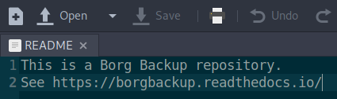
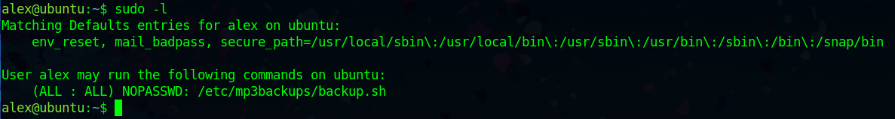
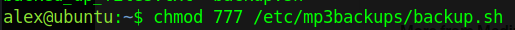
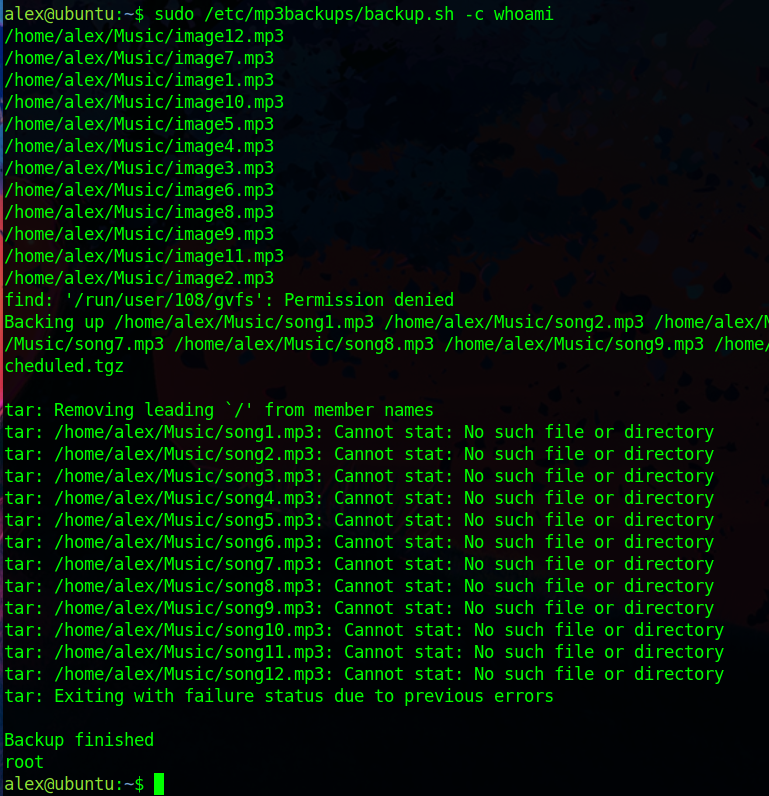

# TryHackMe: Cyborg

## Task 1: Deploy the machine
### Question 1: Deploy the machine - :heavy\_check_mark:


## Task 2: Compromise the System
Используем nmap для сканирования машины:
```sh
nmap -sC -sV 10.10.82.94
```


Мы нашли:
- 22 port - SSH (OpenSSH 7.2p2)
- 80 port - HTTP (Apache httpd 2.4.18)

### Question 2: Scan the machine, how many ports are open? - 2
### Question 3: What service is running on port 22? - ssh
### Question 4: What service is running on port 80? - http

На порте 80 в корневой директории находится Apache 2 Ubuntu Default Page:


Запустим перебор директорий:
```sh
gobuster dir -u http://10.10.82.94/ -w /usr/share/wordlists/dirbuster/directory-list-2.3-medium.txt
```


Найденные директории:
- /admin
- /etc

Посмотрим найденные директории:


Осмотрим директорию /etc более детально:


Перенесем найденный хэш пароля в текстовый файл для дальнейшего брута:


Вернемся на /admin, на вкладку "Admins":


В админском чате сказано, что существует "music_archive". Попробуем перейти во вкладку "Archive":


Загрузим архив:


Осмотрим содержимое:




Удалось узнать, что backup создан при помощи **Borg Backup**. Мы нашли также в конфиг-файле id и key, что возможно нам понадобится в дальнейшем.

Для того, чтобы открыть (а перед этим монтировать) backup, необходим пароль. Вспоминаем, что мы нашли хэш пароля. Брутим его:


Найденный пароль - **squidward**

Разархивируем скачанный ранее архив:


Проверим, определяется ли backup через borg list:


Монтируем в созданную заранее папку:


Осмотрим файлы, которые находятся в backup'е:


Находим следующие данные - **alex:S3cretP@s3**

Попробуем подключиться по SSH:


После успешного подключения, находим первый флаг:


### Question 5: What is the user.txt flag? - flag{1_hop3_y0u_ke3p_th3_arch1v3s_saf3}

Проверим права, который нам доступны относительно sudo:



Находим bash-скрипт. Его часть на рисунке ниже:


Назначим ему права:



Кстати, скрипт позволяет ввести свою команду при активации, что показано на рисунках ниже:




Как видим, скрипт ответил нам, что мы действуем внутри него от лица root-пользователя. Тем самым, мы можем сразу прочитать root-флаг:


Но такой вариант меня не очень устроил, поэтому вот еще некоторые способы:


В этом способе получается так, что вывод всех введенных команд происходит при завершении сеанса использования олболочки, что тоже не очень удобно, поэтому третий способ:


Тут мы просто меняем .sh скрипт, чтобы выполнилась команда, вызывающая bash-оболочку (от имени root-пользователя).

### Question 6: What is the root.txt flag? - flag{Than5s_f0r_play1ng_H0p£_y0u_enJ053d}
