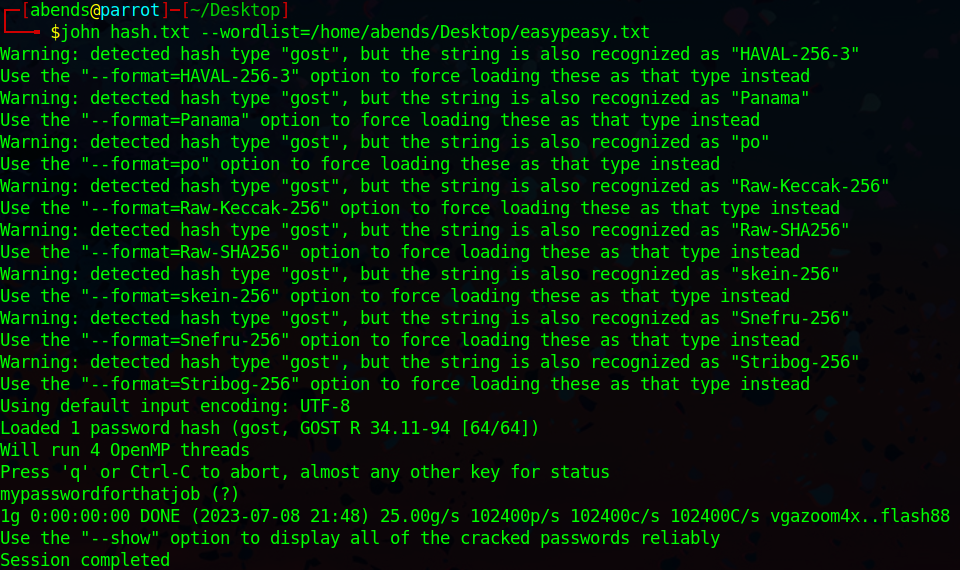

# TryHackMe: Easy Peasy

## Task 1: Enumeration through Nmap

Используем Nmap для сканирования машины:
```sh
sudo nmap -sC -sV -p- -Pn 10.10.224.208
```


```sh
nmap -sC -sV -p 65524 10.10.224.208
```


Мы нашли:
- 80 port - HTTP (Nginx 1.16.1)
- 6498 port - SSH (OpenSSH 7.6p1)
- 65524 port - HTTP (Apache 2.4.43)

### Question 1: How many ports are open? - 3

### Question 2: What is the version of nginx? - 1.16.1

### Question 3: What is running on the highest port? - Apache


## Task 2: Compromising the machine

Приверим активные веб-сервисы:


Обнаруживаем стандартные страницы Apache и Nginx. Помимо этого, к заданию приложен файл **easypeasy.txt**, который представляет собой словарь:


Используем **gobuster** для поиска директорий на сайтах:
```sh
gobuster dir -u http://10.10.224.208:80 -w /usr/share/wordlists/dirbuster/directory-list-2.3-medium.txt
```


Находим директорию **/hidden**, но тут совершенно пусто:


Ищем дальше:

```sh
gobuster dir -u http://10.10.224.208:80/hidden -w /usr/share/wordlists/dirbuster/directory-list-2.3-medium.txt
```


Внутри директории **/hidden** находим директорию **/whatever**:


Внутри обнаруживаем скрытую строку в формате base64, это и есть первый флаг:


### Question 4: Using GoBuster, find flag 1 - flag{f1rs7_fl4g}

Далее смотрим в сторону **robots.txt** на другом веб-ресурсе:


Тут в поле **User-Agent** находим хэш, это наш второй флаг:


### Question 5: Further enumerate the machine, what is flag 2? - flag{1m_s3c0nd_fl4g}

Затем был найден третий флаг, который скрыт среди текста в **Apache Default Page**:


На **CrackStation** находим значение хэша - **candeger** -  внутри обертки флага:


Странно, но в качестве ответа принимается именно хэш, обернутый во flag{}, не могу сказать, почему именно так происходит, но факт есть факт.

### Question 6: Crack the hash with easypeasy.txt. What is the flag 3? - flag{9fdafbd64c47471a8f54cd3fc64cd312}

Также внутри **Apache Default Page** находим скрытый зашифрованный текст:


Через идентификатор шифра узнаем, что это Base62:


Тем самым, мы нашли скрытую директорию.

### Question 7: What is the hidden directory? - /n0th1ng3ls3m4tt3r

Если перейти в скрытую директорию, можно обнаружить картинку:


А также и скрытый текст, который представляет собой хэш:


Найденный хэш расшифровываем при помощи инструмента **JohnTheReaper** и словаря **easypeasy.txt**:



### Question 8: Using the wordlist that provided to you in this task crack the hash. What is the password? - mypasswordforthatjob

Теперь разбираемся с картинкой. Во-первых, скачиваем ее себе:


Во-вторых, с помощью **steghide** и пароля **mypasswordforthatjob** получаем текстовый файл, который был спрятан внутри картинки:


Внутри обнаруживаем логин **boring** и пароль в двочном представлении. Переводим его в текстовый вариант:


### Question 9: What is the password to login to the machine via SSH? - iconvertedmypasswordtobinary

Подключаемся по SSH с помощью найденных данных и читаем первый флаг:


Флаг оказывается зашифрованным, но это всего лишь ROT13:


### Question 10: What is the user flag? - flag{n0wits33msn0rm4l}

Проверим, можем ли мы использовать sudo:


К сожалению, не можем. Посмотрим в **crontab**:


Здесь обнаруживаем, что относительно пользователя **root** исполняется bash-скрипт **.mysecretcronjob.sh**:


Внутри этого скрипта нет полезной нагрузки. Только подсказка, которая говорит нам о том, что все команды внутри данного скрипта выполняются относительно суперпользователя. Получается, что, реализовав reverse shell через этот скрипт, мы получим доступ к root-пользователю. Проверим версию python3:


Находим команду, которая поможет реализовать reverse shell:


Переносим полученную команду внутрь скрипта:


Не забывает поставить порт на прослушивание:


Активируем скрипт и получаем полный доступ к системе:


Читаем последний флаг:


### Question 11: What is the root flag? - flag{63a9f0ea7bb98050796b649e85481845}
