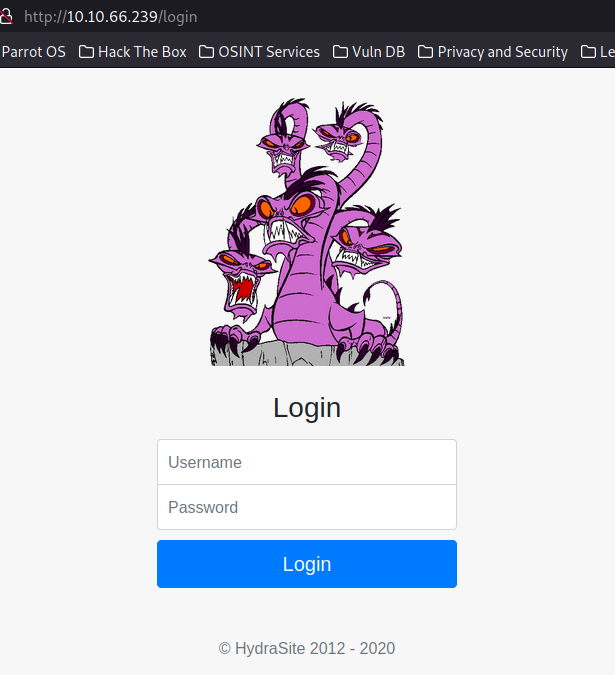
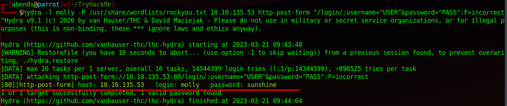
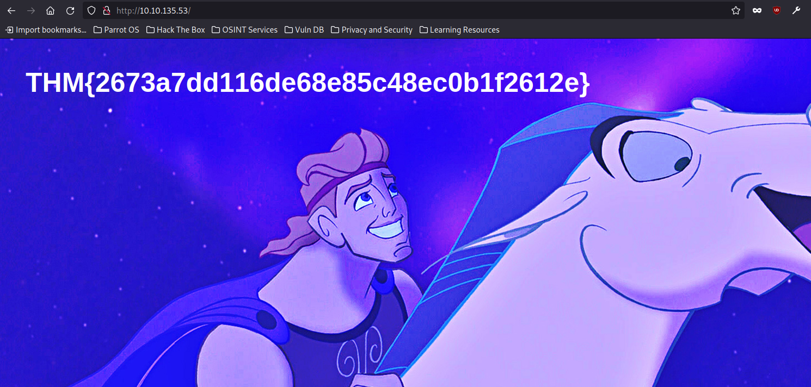
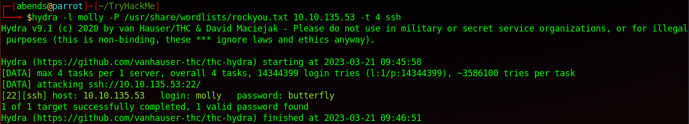
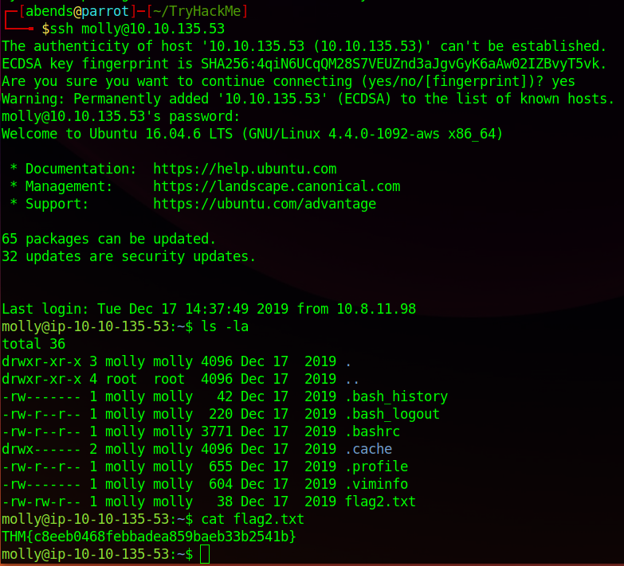

# TryHackMe Info: Hydra

## Task 1: Hydra Introduction
Hydra является мощным программным инструментом для автоматического перебора паролей и/или логинов (метод грубой силы - brute force). Представим, что мы пытаемся угадать чей-то пароль для последующей аутентификации с помощью найденного пароля (SSH, форма веб-приложения, FTP или SNMP и др.). Делать это вручную не самая лучшая затея, как минимум, из-за того, что это долго, а, как максимум, пароля модет просто не оказаться в словарей, причем вероятность такого события достаточно велика.

Hydra может работать со следующими протоколами: Asterisk, AFP, Cisco AAA, Cisco auth, Cisco enable, CVS, Firebird, FTP,  HTTP-FORM-GET, HTTP-FORM-POST, HTTP-GET, HTTP-HEAD, HTTP-POST, HTTP-PROXY, HTTPS-FORM-GET, HTTPS-FORM-POST, HTTPS-GET, HTTPS-HEAD, HTTPS-POST, HTTP-Proxy, ICQ, IMAP, IRC, LDAP, MS-SQL, MYSQL, NCP, NNTP, Oracle Listener, Oracle SID, Oracle, PC-Anywhere, PCNFS, POP3, POSTGRES, RDP, Rexec, Rlogin, Rsh, RTSP, SAP/R3, SIP, SMB, SMTP, SMTP Enum, SNMP v1+v2+v3, SOCKS5, SSH (v1 and v2), SSHKEY, Subversion, Teamspeak (TS2), Telnet, VMware-Auth, VNC and XMPP.

Все вышесказанное можно рассмотреть относительно безопасности паролей. Все мы знаем, что использование простого пароля (без специальных символов, длинной менее 8 символов) повышает вероятность возможной компрометации. Стоит также помнить о том, что необходимо менять дефолтные пароли и логины, которые установлены в различном ПО по умолчанию (например, в СУБД, веб-фреймворках и т.п.).

## Task 2: Using hydra
Параметры, которые мы передаем в Hydra, зависят от того, какой сервис (протокол) мы атакуем. Например, если бы мы хотели провести брутфорс FTP с именем пользователя user и списком паролей в виде passlist.txt, мы бы использовали следующую команду:
```sh
hydra -l <username> -P <full path to pass> ftp://10.10.66.239
```

Относительно SSH данная команда может выглядеть следующим образом:
```sh
hydra -l <username> -P <full path to pass> 10.10.66.239 -t 4 ssh
```

Теперь относительно параметров:
- -l - однозначно определяет и фиксирует пользователя
- -P - указывает на словарь паролей, по которому идет перебор пароля
- -t - количество потоков

Еще один пример - Post Web Form. При переборе данных веб-форм, Hydra работает с GET и POST запросами:
```sh
hydra -l <username> -P <wordlist> 10.10.66.239 http-post-form "/login/:username=^USER^&password=^PASS^:F=incorrect" -V
```

Параметры:
- -l - однозначно определяет и фиксирует пользователя
- -P - указывает на словарь паролей, по которому идет перебор пароля
- -V - подробный вывод для каждой попытки
- http-post-form - явнок указание типа формы (post)
- :username - поле формы, куда вводится имя пользователя
- password - поле формы, куда вводится пароль
- \^USER\^ - сообщает Hydra, какое имя пользователя использовать (либо из словаря, либо фиксированное, если знаем)
- \^PASS\^ - сообщает Hydra, какой пароль использовать (из словаря)
- F:incorrect - добавление исключения

Стоит отметить, что Hydra может перебирать не только пароли относительно одного конкретного логина, она может делать перебор пары логин/пароль. Или же, наоборот, по известному паролю найти логин. Примеры ниже.

Пароль:
```sh
hydra -l <username> -P <full path to pass> ftp://10.10.66.239
```

Логин/пароль:
```sh
hydra -L <full path to userlist> -P <full path to passlist> 10.10.66.239 -t 4 ssh
```

Логин:
```sh
hydra -L <full path to userlist> -p <password> 10.10.66.239 -t 4 ssh
```

Другие примеры, а также доступные параметры можно посмотреть, набрав в терминале: *hydra -h*

*Question 1*: Use Hydra to bruteforce molly's web password. What is flag 1? - **THM{2673a7dd116de68e85c48ec0b1f2612e}**







*Question 2*: Use Hydra to bruteforce molly's SSH password. What is flag 2? - **THM{c8eeb0468febbadea859baeb33b2541b}**




