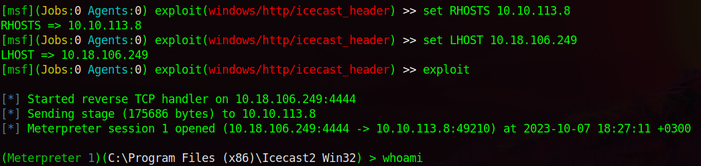
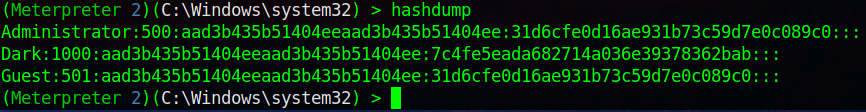

# TryHackMe: Ice

---

## Task 1: Connect

Подключаемся к сети и проверяем доступность компьютера жертвы:

---

## Task 2: Recon

Запускаем Nmap для нахождения открытых портов:

### Question 1: Once the scan completes, we'll see a number of interesting ports open on this machine. As you might have guessed, the firewall has been disabled (with the service completely shutdown), leaving very little to protect this machine. One of the more interesting ports that is open is Microsoft Remote Desktop (MSRDP). What port is this open on? - 3389

### Question 2: What service did nmap identify as running on port 8000? (First word of this service) - Icecast

### Question 3: What does Nmap identify as the hostname of the machine? (All caps for the answer) - DARK-PC

---

## Task 3: Gain Access

### Question 4: Now that we've identified some interesting services running on our target machine, let's do a little bit of research into one of the weirder services identified: Icecast. Icecast, or well at least this version running on our target, is heavily flawed and has a high level vulnerability with a score of 7.5 (7.4 depending on where you view it). What type of vulnerability is it? Use https://www.cvedetails.com for this question and the next. - execute code overflow

### Question 5: What is the CVE number for this vulnerability? - CVE-2004-1561

Ищем эксплойт для Icecast в Metasploit:

### Question 6: What is the full path (starting with exploit) for the exploitation module? - exploit/windows/http/icecast_header

Выбираем эксплойт и выставляем параметры RHOSTS и LHOST

What is the only required setting which currently is blank? - rhosts

Запускаем эксплойт:

---

## Task 4: Escalate

### Question 7: What's the name of the shell we have now? - meterpreter

Для того, чтобы узнать, от имени какого пользователя мы действуем, введем команду **getuid**:

### Question 8: What user was running that Icecast process? - Dark

Далее просмотрим системные параметры посредством команды **sysinfo**:

### Question 9: What build of Windows is the system? - 7601

### Question 10: What is the architecture of the process we're running? - x64

После этого запустим **run post/multi/recon/local_exploit_suggester**, для того, чтобы найти эксплойты на повышение привилегий, которые применимы для системы жертвы:

### Question 11: What is the full path (starting with exploit/) for the first returned exploit? - exploit/windows/local/bypassuac_eventvwr

Далее помещаем текущую сессию в фоновый режим при помощи команды **background**:

Выбираем найденный эксплойт:

Как можно заметить, данный эксплойт требует наличия номера уже открытой сессии, которую мы уже реализовали. При этом также стоит обратить внимание на параметр LHOST (наш IP-адрес интерфейса tun0). Устанавливаем вышеупомянутые параметры:

### Question 12: We'll have to set one more as our listener IP isn't correct. What is the name of this option? - LHOST

Собственно, теперь мы можем убедиться, что у нас есть расширенные разрешения, используя команду **getprivs**:

### Question 13: What permission listed allows us to take ownership of files? - SeTakeOwnershipPrivilege

---

## Task 5: Looting

Прежде чем предпринимать дальнейшие действия, нам необходимо перейти к процессу, который действительно имеет разрешения, необходимые нам для взаимодействия со службой lsass, службой, отвечающей за аутентификацию в Windows. Сначала давайте перечислим процессы, используя команду **ps**. Обратите внимание: мы можем видеть процессы, запускаемые NT AUTHORITY\SYSTEM, поскольку у нас есть повышенные разрешения (хотя наш процесс этого не делает).

Чтобы взаимодействовать с lsass, нам нужно «жить» в процессе, имеющем ту же архитектуру, что и служба lsass (x64 в случае этой машины), и в процессе, имеющем те же разрешения, что и lsass. Служба очереди печати принтера идеально отвечает нашим потребностям, и она перезапустится, если мы ее аварийно завершаем! Как называется принтерный сервис?

### Question 14: В этом вопросе упоминается термин «жить в процессе». Часто, когда мы берем на себя управление работающей программой, мы в конечном итоге загружаем в программу другую общую библиотеку (dll), которая включает в себя наш вредоносный код. Благодаря этому мы можем создать новый поток, в котором будет размещаться наша оболочка - spool.exe

Для миграции из текущего процесса используем команду **migrate -N PROCESS_NAME**

Как можно заметить (по выводам команд getuid) мы сменили пользователя, причем на администратора

### Question 15: Let's check what user we are now with the command `getuid`. What user is listed? - NT AUTHORITY\SYSTEM

Теперь, когда мы получили полные права администратора, мы нацелимся на грабежи. Mimikatz — довольно известный инструмент для сброса паролей, который невероятно полезен. Загрузим его, используя команду **load kiwi** (Kiwi — это обновленная версия Mimikatz):

### Question 16: Which command allows up to retrieve all credentials? - creds_all

При помощи команды **creds_all** узнаем пароль от пользователя **Dark**

### Question 17: What is Dark's password? - Password01!

---

## Task 6: Post-Exploitation

### Question 18: What command allows us to dump all of the password hashes stored on the system? - hashdump

При помощи команды **hashdump** получаем все пароли (захэшированные):

### Question 19: What command allows us to watch the remote user's desktop in real time? - screenshare

При помоши команды **screenshare** можно наблюдать за жертвой в реальном времени:

Заметим, что открывается HTML-файл, но мы же хотели получить вид со стороны пользователя. На самом деле это нормально, просто нужно этот файл открыть в браузере:

### Question 20: How about if we wanted to record from a microphone attached to the system? - record_mic

### Question 21: To complicate forensics efforts we can modify timestamps of files on the system. What command allows us to do this? - timestomp

### Question 22: Mimikatz allows us to create what's called a **golden ticket**, allowing us to authenticate anywhere with ease. What command allows us to do this? - golden_ticket_create

Атаки по «золотому билету» — это функция Mimikatz, которая злоупотребляет компонентом Kerberos (система аутентификации в доменах Windows), билетом выдачи билетов. Короче говоря, атаки по «золотому билету» позволяют нам сохранять постоянство и аутентифицироваться как любой пользователь в домене.

Поскольку у нас есть пароль для пользователя «Dark», мы теперь можем пройти аутентификацию на машине и получить к ней доступ через удаленный рабочий стол (MSRDP). Для того, чтобы воспользоваться данной функцией, необходимо запустить команду **run post/windows/manage/enable_rdp**, тогда служба RDP активируется и можно подключаться:

---

