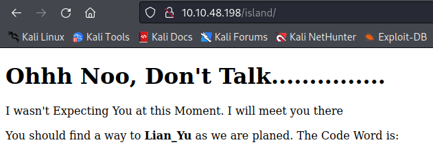

# TryHackMe: Lian_Yu

## Task 1: Find the Flags

### Question 1: Deploy the VM and Start the Enumeration - :heavy\_check_mark:

Для начала проведем сканирование целевого хоста при помощи Nmap:
```sh
nmap -sC -sV 10.10.48.198 -T5
```


Найденные сервисы и службы:
- 21 port - FTP (vsftpd 3.0.2)
- 22 port - SSH (OpenSSH 6.7p1)
- 80 port - HTTP (Apache httpd)
- 111 port - RPC (rpcbind 2-4)

Посмотрим на сайт, который расположен на 80 порте:


Запустим сканирование директорий сайта:
```sh
gobuster dir -u http://10.10.48.198 -w /usr/share/wordlists/dirbuster/directory-list-2.3-medium.txt
```


Находим директорию **/island**:



Среди текста на странице, находим скрытое ключевое слово **vigilante**:


Снова запускам Gobuster, но перебор будем осуществлять внутри директории **/island**:
```sh
gobuster dir -u http://10.10.48.198/island -w /usr/share/wordlists/dirbuster/directory-list-2.3-medium.txt
```


Находим директорию **/2100**:


### Question 2: What is the Web Directory you found? - /2100

Самое интересное, что видео с YouTube заблокировано **:)**

В прочем, это, забегая вперед, не играет никакой роли. В исходном коде страницы была найдена подсказка **.ticket**. 


Попробуем найти файл с таким расширением на сайте (/island/2100/).
```sh
gobuster dir -u http://10.10.48.198/island/2100 -w /usr/share/wordlists/dirbuster/directory-list-2.3-medium.txt -x .ticket
```


В итоге находим следующий файл: **green_arrow.ticket**

### Question 3: What is the file name you found? - green_arrow.ticket

Перейдем к самому файлу:


Находим некий "токен" (по всей видимости, пароль) - **RTy8yhBQdscX**. Вот только этот пароль не подходит для FTP, по всей видимости он зашифрован.

При помощи инструмента CyberChef и компонента Base58 расшифровываем пароль:


### Question 4: What is the FTP Password? - !#th3h00d

Перейдем на FTP-сервер при помощи найденных логина и пароля: **vigilante**:**!#th3h00d**. Файлы, находящиеся в директории **/home/vigilante**:


Скачиваем все найденные картинки:


Замечаем, что один из файлов поврежден, проверим его на наличие, каких-либо артефактов или данных.


Видим, что файл, скорее всего, поломан. Посмотрим его в hex-редакторе (hexedit).
```sh
hexedit Leave_me_alone.png
```


Блоки IDAT и IHDR подтверждают структуру PNG-файла, но, по всей видимости, он поломан именно в самом начале. Воспользуемся памяткой с правильной структурой PNG.


Поменяем значения некоторых байт в соотвествии с шаблоном:


В итоге, имеем восстановленную картинку:


Получаем только **password**. Возможно, с помощью **steghide** в изображении что-то скрыто, а **password** является парольной фразой:


Хм, в самой картинке ничего нет, попробуем то же самое с другими:


Извлекли архив. Внутри него два файла:


В файле **shado** находится пароль от SSH - **M3tahuman**


### Question 5: What is the file name with SSH password - M3tahuman

Во втором файле находится какое-то общее описание:


Но вот у нас нет логина для подключения по SSH. Тут мы обращаем еще раз внимание на содержимое FTP-сервера. В папке **/vigilante** находится файл **.other_user**, в котором речь идет о неком **Slade Wilson**. 


Пробуем в качестве логина **slade**, а в качестве пароля **M3tahuman**:


И да! Мы внутри. Забираем первый флаг:


### Question 6: user.txt - THM{P30P7E_K33P_53CRET5__C0MPUT3R5_D0N'T}

Посмотрим, что мы можем выполнять в системе от лица sudo:


Нам доступна команда pkexec. Можно ли через нее повысить привилегии? Можно **:)**


Остается дело за малым, прочитать root-флаг:


### Question 7: root.txt - THM{MY_W0RD_I5_MY_B0ND_IF_I_ACC3PT_YOUR_CONTRACT_THEN_IT_WILL_BE_COMPL3TED_OR_I'LL_BE_D34D}
