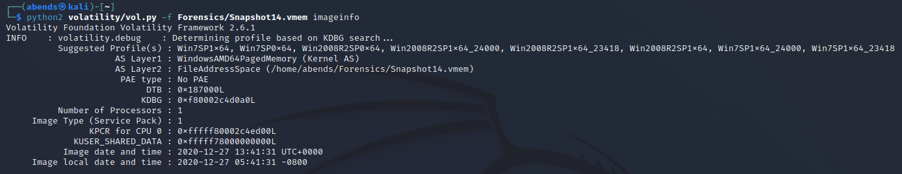

# TryHackMe: Memory Forensics

## Task 1: Introduction

Useful resourse:
*Volatility*: https://github.com/volatilityfoundation/volatility/
*Volatility3*: https://github.com/volatilityfoundation/volatility3/
*Volatility Command Reference*: https://github.com/volatilityfoundation/volatility/wiki/Command-Reference#imageinfo
*Cheatsheet 1*: https://book.hacktricks.xyz/generic-methodologies-and-resources/basic-forensic-methodology/memory-dump-analysis/volatility-examples
*Cheatsheet 2*: https://blog.onfvp.com/post/volatility-cheatsheet/

## Task 2: Login
The forensic investigator on-site has performed the initial forensic analysis of John's computer and handed you the memory dump he generated on the computer. As the secondary forensic investigator, it is up to you to find all the required information in the memory dump.

Для начала необходимо более детально изучить полученный нами образ памяти - понять, с какой операционной системы он взят. Для этого воспользуемся командой ***imageinfo***:
```sh
python2 volatility/vol.py -f Snapshot6.vmem imageinfo
```


Далее получим хэши паролей пользователей при помощи команды ***hashdump***:
```sh
python2 volatility/vol.py -f Snapshot6.vmem --profile=Win7SP1x64 hashdump
```


Затем сбрутим пароль при помощи ***JohnTheRipper*** и словаря ***rockyou.txt***:
```sh
john --format=NT hash.hash --wordlist=/usr/share/wordlists/rockyou.txt
```


### Question 1: What is John's password? - charmander999


## Task 3: Analysis
On arrival a picture was taken of the suspect's machine, on it, you could see that John had a command prompt window open. The picture wasn't very clear, sadly, and you could not see what John was doing in the command prompt window. To complete your forensic timeline, you should also have a look at what other information you can find, when was the last time John turned off his computer?

Начинаем с осмотра образа:


Узнать последнее время выключения нам поможет команда ***shutdowntime***:
```sh
python2 volatility/vol.py -f Snapshot6.vmem --profile=Win7SP1x64 shutdowntime
```


### Question 2: When was the machine last shutdown? - 2020-12-27 22:50:12

Посмотрим, что написал John в консоли, при помощи ***consoles***:
```sh
python2 volatility/vol.py -f Snapshot6.vmem --profile=Win7SP1x64 consoles
```


### Question 3: What did John write? - You\_found_me


## Task 4: TrueCrypt
A common task of forensic investigators is looking for hidden partitions and encrypted files, as suspicion arose when TrueCrypt was found on the suspect's machine and an encrypted partition was found. The interrogation did not yield any success in getting the passphrase from the suspect, however, it may be present in the memory dump obtained from the suspect's computer.

Осматриваем образ:



Далее ищем зашифрованные данные (от программы TrueCrypt), используя команду ***truecryptpassphrase***:
```sh
python2 volatility/vol.py -f Snapshot6.vmem --profile=Win7SP1x64 truecryptpassphrase
```


### Question 4: What is the TrueCrypt passphrase? - forgetmenot
