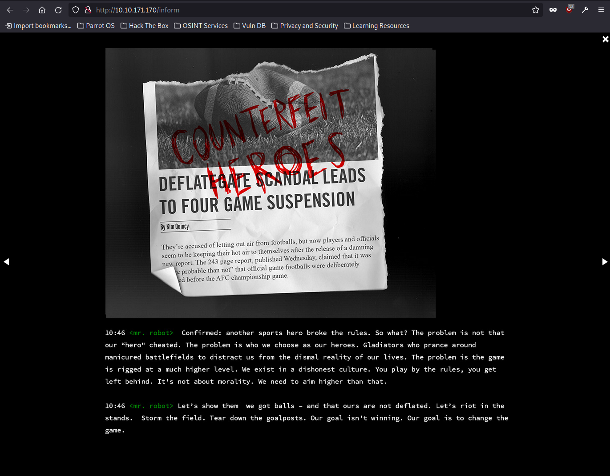
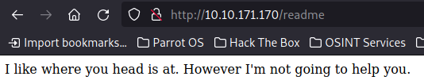

# TryHackMe: Mr Robot CTF


## Task 1: Hack the machine
Используем nmap для сканирования машины:
```sh
nmap -sC -sV 10.10.171.170
```


Мы нашли:
- 22 port - SSH (closed)
- 80 port - HTTP (Apache httpd)
- 443 port - HTTPS (Apache httpd)

Перейдем на сам сайт (80 порт):


На выбор предоставляются некоторые команды, но, проверив их, ничего интересного они не приносят в плане развития атаки. Вот некоторые примеры исполнения "команд":




На последней картинке в исходном коде страницы можно увидеть интересный баннер: **"YOU ARE NOT ALONE"**

Далее попробуем найти какие-либо директории на сайте:


Директория **/readme**:



Директория **/0**:


Из интресного, был найден файл **robots.txt**:


Здесь можно увидеть 2 скрытые директории (точнее файла). В первой находится первый флаг:


### Question 1: What is key 1? - 073403c8a58a1f80d943455fb30724b9

А в другой находится словарь, который нам скорее всего пригодится далее. После этого, обратим внимание на другие найденные директории с обозначением **wp**, что говорит нам о том, что в основе сайта лежит **WordPress**:


Далее перехватим запрос при помощи **BurpSuite** при попытке авторизации на сайте:


Словарь, который мы нашли ранее, похож на словарь с логинами (а может быть и паролями):


Перенаправим захваченный запрос в Intruder, выделив поле **login** для подстановки значений из найденного словаря:


По длине ответа находим логин **Elliot**:


Теперь попробуем найти пароль при помощи инструмента **WPScan**:


Найденный пароль - **ER28-0652** (операция по нахождению пароля действительно долгая, потому что пароль оказался внизу списка). Входим в аккаунт:


Посмотрим вкладку Users:


Узнаем, что Elliot - администратор, а также помимо него есть и другой пользователь. В одной из тем находим интересный шаблон с расширением **.php**.


Исходный код найденного шаблона:


Скорее всего, таким способом можно реализовать reverse shell, заменив содержимое шаблона на код из файла phpreverseshell от pentestmonkey, но перед этим реализуем прослушивание порта на хостовой системе:


К слову, здесь reverse shell можно получить несколькими способами, например просто вызвав нужную php-функцию:


Переходим непосредственно к этому шаблону, чтобы активировать скрипт, но перед этим не забываем сохранить изменения:


В итоге у нас получилось реализовать reverse shell:


Забегая вперед, скажу, что данный метод у меня впоследствии не сработал в плане дальнейшего развития атаки - я не смог перейти к другому пользователю из-за предупреждения - **su: must be run from a terminal**

Находим директорию со вторым ключом, но файл прочитать не можем:


Далее я реализовал reverse shell иным способом:


Активируем:


И получаем новый shell:


Вызываем bash-оболочку:


Продолжаем работу. Помимо второго ключа был найден и файл с хэшем пароля. Попробуем найти этот пароль через **CrackStation**:


Пароль - **abcdefghijklmnopqrstuvwxyz**

Вот и та проблема, которая у меня возникла:


Тут, как уже говорилось ранее, был реализован новый reverse shell. При этом входим относительно пользователя robot:


Получаем второй флаг:


### Question 2: What is key 2? - 822c73956184f694993bede3eb39f959

Проверим наши права:


Так, пользователь не может использовать sudo, поэтому попробуем по-другому:


Из интересного, нам доступен **nmap**. Проверим, можно ли через него повысить привилегии:


Да, действительно можно, надо просто запустить nmap в интерактивном режиме:


Вот мы и получили root'а, получаем третий флаг:


### Question 3: What is key 3? - 04787ddef27c3dee1ee161b21670b4e4
