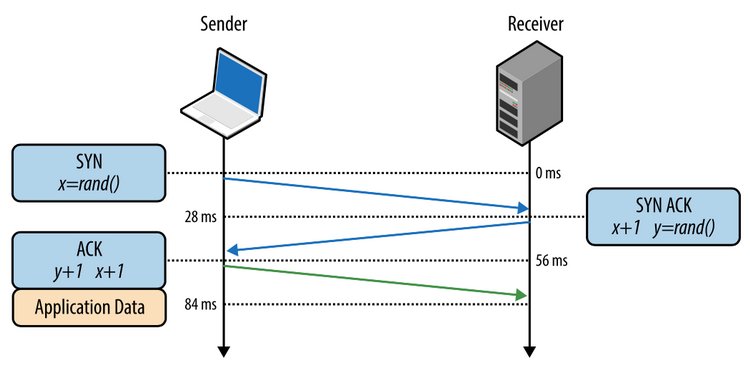

# TryHackMe Info: Nmap

## Task 1: Deploy
## Task 2: Introduction
Стоит как и всегда начать с некоторых базовых понятий. Во-первых, разберемся в том, что такое порт.

**Порт** - это натуральное число от 0 до 65535, которое записывается в заголовках протоколов транспортного уровня сетевой модели OSI. Примерно так сказано в Википедии, но если говорить более понятно, то это некое виртуальное расширение, дополнение к IP-адресу, т.е. компьютер благодаря портам может правильно обрабатывать ту или иную информацию. По умолчанию приложению выдается порт с произвольным номером (к примеру, ближайшим свободным, большим 1234). При необходимости приложение может запросить конкретный (предопределённый) номер порта. Так веб-серверы обычно открывают для ожидания соединения предопределённый порт 80 протокола TCP.

А теперь представим себе ситуацию, когда нам дан, например, один IP-адрес целевой машины (или некий пул адресов). Как нам узнать, что происходит в пределах данного компьютера/сервера? К каким портам мы можем обращаться и т.д. Другими словами, нам надо разузнать как можно больше о цели, провести *разведку*, причем сделать это нужно легко, но в тоже время получить достаточно информации, чтобы двигаться далее. 

Возвращаясь к понятию порта, сам по себе порт не является приоритетной целью, да, он показывает номер (сообщает о том, куда направлять данные, чтобы их правильно обработать), но за этим номер стоит более ключевое понятие - сетевая служба.


**Сетевая служба** - совокупность серверной и клиентской частей ОС, предоставляющих доступ к конкретному типу ресурса компьютера через сеть.

Подытожив, можно сказать, что сетевые соединения устанавливаются между двумя портами — открытым портом, прослушиваемым на сервере, и случайно выбранным портом на вашем собственном компьютере. Например, когда вы подключаетесь к веб-странице, ваш компьютер может открыть порт 49534 для подключения к порту 443 сервера.

Отметим, что каждый компьютер имеет 65535 портов, причем довольно много из них зарезервированы, т.е. закреплены за отдельными сетевыми службами. К примеру:
- 21 port - FTP
- 22 port - SSH
- 80 port - HTTP

С полным списоком можно ознакомиться по ссылке: https://en.wikipedia.org/wiki/List_of_TCP_and_UDP_port_numbers

Конечно, это не означает, что какая-то служба обязательно стоит за определенным портом, в некоторых ситуациях номер порта можно переопределить, но стоит следить за тем, чтобы сетевые службы в таком случае не пересекались.

Собственно, чтобы распознать сетевые сетевые службы и их номера (порты), можно воспользоваться разными инструментами, но самым стандартным и проверенный временем из них - Nmap.

**Nmap** — свободная утилита, предназначенная для разнообразного настраиваемого сканирования IP-сетей с любым количеством объектов, определения состояния объектов сканируемой сети (портов и соответствующих им служб).

*Question 1*: What networking constructs are used to direct traffic to the right application on a server? - **ports**

*Question 2*: How many of these are available on any network-enabled computer? - **65535**

*Question 3*: [Research] How many of these are considered "well-known"? (These are the "standard" numbers mentioned in the task) - **1024**


## Task 3: Nmap Switches
Для начала стоит ознакомиться с данной утилитой. Nmap является по большей части консольной утилитой, предназначенной для Unix-подобных ОС, но на данный момент уже существуют версия, например, для Windows, причем есть и графический интерфейс у данной утилиты (Zenmap). Для того, чтобы посмотерть мануал утилтиты, необходимо в терминале ввести:
```sh
nmap -h
```

Некоторая часть мануала:


Теперь, будем разбираться с ним, отвечая на вопросы, представленные в задании.

*Question 4*: What is the first switch listed in the help menu for a 'Syn Scan' (more on this later!)? - **-sS**

*Question 5*: Which switch would you use for a "UDP scan"? - **-sU**

*Question 6*: If you wanted to detect which operating system the target is running on, which switch would you use? - **-O**

*Question 7*: Nmap provides a switch to detect the version of the services running on the target. What is this switch? - **-sV**

*Question 8*: The default output provided by nmap often does not provide enough information for a pentester. How would you increase the verbosity? - **-v**

*Question 9*: Verbosity level one is good, but verbosity level two is better! How would you set the verbosity level to two? (Note: it's highly advisable to always use at least this option) - **-vv**

*Question 10*: We should always save the output of our scans -- this means that we only need to run the scan once (reducing network traffic and thus chance of detection), and gives us a reference to use when writing reports for clients. What switch would you use to save the nmap results in three major formats? - **-oA**

*Question 11*: What switch would you use to save the nmap results in a "normal" format? - **-oN**

*Question 12*: A very useful output format: how would you save results in a "grepable" format? - **-oG**

*Question 13*: Sometimes the results we're getting just aren't enough. If we don't care about how loud we are, we can enable "aggressive" mode. This is a shorthand switch that activates service detection, operating system detection, a traceroute and common script scanning. How would you activate this setting? - **-A**

*Question 14*: Nmap offers five levels of "timing" template. These are essentially used to increase the speed your scan runs at. Be careful though: higher speeds are noisier, and can incur errors! How would you set the timing template to level 5? - **-T5**

*Question 15*: We can also choose which port(s) to scan. How would you tell nmap to only scan port 80? - **-p 80**

*Question 16*: How would you tell nmap to scan ports 1000-1500? - **-p 1000-1500**

*Question 17*: A very useful option that should not be ignored: How would you tell nmap to scan *all* ports? - **-p-**

*Question 18*: How would you activate a script from the nmap scripting library (lots more on this later!)? - **--script**

*Question 19*: How would you activate all of the scripts in the "vuln" category? - **--script=vuln**


## Task 4: Scan Types - Overview
В Nmap есть три базовых типа сканирования:
- TCP Connect Scans (**-sT**)
- SYN "Half-open" Scans (**-sS**)
- UDP Scans (**-sU**)

Кроме того, есть несколько менее распространенных типов сканирования:
- TCP Null Scans ( **-sN**)
- TCP FIN Scans (**-sF**)
- TCP Xmas Scans (**-sX**)

Большинство из них (за исключением сканирования UDP) используются практически одинаково с целью сканирования и определения служб на целевой машине, однако способ их работы различается. Это означает,  что, несмотря на то, что в большинстве ситуаций вам, скорее всего, подойдет одно из первых трех сканирований,  стоит помнить, что существуют и другие типы сканирования, т.к. при их использовании может быть получен более информативный результат


## Task 5: Scan Types - TCP Connect Scans
Тут стоит освежить в памяти такую вещь, как "**Three-Way Handshake**. Протокол TCP использует данный процесс для того, чтобы установить надежное соединение. Основной принцип - оба канала могут передавать информацию одновременно, если они синхронизируют (SYN) и подтверждают (ACK) друг друга. Обмен выполняется следующим образом:
1) Клиент отправляет сегмент с установленным флагом SYN. При этом сегменту присваивается произвольный порядковый номер (sequence number) в интервале от 1 до 232 (т.н. initial sequence number), относительно которого будет вестись дальнейший отсчет последовательности сегментов в соединении.
2) Сервер получает запрос и отправляет ответный сегмент с одновременно установленными флагами SYN+ACK, при этом записывает в поле «номер подтверждения» (acknowledgement number), полученный порядковый номер, увеличенный на 1 (что подтверждает получение первого сегмента), а также устанавливает свой порядковый номер, который, как и в SYN-сегменте, выбирается произвольно.
3) После получения клиентом сегмента с флагами SYN+ACK соединение считается установленным, клиент, в свою очередь, отправляет в ответ сегмент с флагом ACK, обновленными номерами последовательности, и не содержащий полезной нагрузки.
4) Начинается передача данных.




Этот принцип составляет некий базис в понимании того, как работают разные типы сканирования, которые будут рассмотрены далее, но самым ключевым здесь является то, что Nmap использует (*не при всех типах сканирования!*) данный подход для каждого целевого порта по очереди, т.е. он много раз повторяет данное действие, но для разных портов.

Если Nmap отправляет TCP-запрос с установленным флагом SYN на закрытый порт, целевой сервер ответит TCP-пакетом с установленным флагом RST (Reset). По этому ответу Nmap может установить, что порт закрыт (*closed*).


Многие брандмауэры настроены так, чтобы просто отбрасывать входящие пакеты. Nmap отправляет запрос TCP SYN и ничего не получает в ответ. Это указывает на то, что порт защищен самим брандмауэром и, следовательно, порт находится в состоянии *filtered*.

Тем не менее, очень легко настроить брандмауэр так, чтобы он отвечал TCP-пакетом RST. Это может сделать чрезвычайно трудным (если не невозможным) получение точных показаний цели (целей). Примером может служить утилита IPtables для Linux:
```sh
iptables -I INPUT -p tcp --dport <port> -j REJECT --reject-with tcp-reset
```
*Question 20*: Which RFC defines the appropriate behaviour for the TCP protocol? - **RFC 793**

*Question 21*: If a port is closed, which flag should the server send back to indicate this? - **RST**


## Task 6: Scan Types - SYN Scans
Данный тип сканирования схож по принципу с TCP-сканированием из прошлого раздела, за исключением того, что после получения от сервера SYN/ACK-флага SYN-сканирование отправляет флаг RST, что предотвращает повторные попытки сервера сделать запрос. Данный тип сканирования также называют "*скрытым сканированием*". Схема функционирования SYN-сканирования:


Отсюда у данного типа сканирования есть ряд преимуществ:
1) Обход систем обнаружения вторжений (IDS), поскольку они ищут полный Three-Way Handshake (имеются ввиду старые IDS-системы);
2) Сканирование SYN часто не регистрируется приложениями, прослушивающими открытые порты, поскольку стандартной практикой является регистрация соединения после его полного установления;
3) Выполняется быстрее, чем TCP-сканирования.

Недостатки:
1) Требуется запуск относительно sudo для возможности создания необработанных пакетов;
2) Нестабильная работа некоторых сканируемых служб.

В том случае, если порт фильтруется или вовсе закрыт, то, как и в случае со стандартным TCP-сканированием, сервер либо отправит нам RST-флаг на закрытие сессии, либо не отправит ничего.

*Question 22*: There are two other names for a SYN scan, what are they? - **Half-open, stealth**

*Question 23*: Can Nmap use a SYN scan without Sudo permissions (Y/N)? - **N**


## Task 7: Scan Types - UDP Scans
Главным отличием протокола UDP относительно TCP является отсутствие подтверждения отправки, т.е. получил ли целевой порт от вас пакеты или нет, узнать вы не сможете. Логично, что при таком подходе информация передается быстрее, чем по протоколу TCP, но открытым отстается вопрос качества передачи данных. При этом сканированием целевого хоста по UDP-протоколу происходит дольше, чем по TCP.

Когда пакет отправляется на открытый порт UDP, ответа быть не должно. Когда это происходит, Nmap обращается к порту как к открытому|отфильтрованному. Другими словами, он подозревает, что порт открыт, но он может быть защищен брандмауэром. Если он получает ответ UDP (что очень необычно), то порт помечается как открытый. Чаще всего ответа нет, и в этом случае запрос отправляется второй раз для перепроверки. Если ответа по-прежнему нет, порт помечается как открытый|отфильтрованный, и Nmap продолжает работу.

Когда пакет отправляется на закрытый порт UDP, цель должна ответить пакетом ICMP (ping), содержащим сообщение о том, что порт недоступен. Это четко идентифицирует закрытые порты, которые Nmap помечает как таковые и движется дальше.

Вследствие того, что сканирование по UDP происзодит медленно, рекомендуется сканировать, например, не все порты, а указать границу проверки при помощи соответствующей команды:
```sh
nmap -sU --top-ports 20 <target>
```

При сканировании UDP-портов Nmap обычно отправляет совершенно пустые запросы — просто необработанные UDP-пакеты. Тем не менее, для портов, которые обычно заняты известными службами, он вместо этого отправляет полезную нагрузку для конкретного протокола, которая с большей вероятностью вызовет ответ, из которого можно будет получить более точный результат.

*Question 24*: If a UDP port doesn't respond to an Nmap scan, what will it be marked as? - **open|filtered**

*Question 25*: When a UDP port is closed, by convention the target should send back a "port unreachable" message. Which protocol would it use to do so? - **ICMP**


## Task 8: Scan Types - NULL, FIN and Xmas
Сканирование TCP-портов NULL, FIN и Xmas используется реже, чем любые другие, которые мы уже рассмотрели, поэтому мы не будем здесь вдаваться в подробности. Все три взаимосвязаны и используются в первую очередь, поскольку они имеют тенденцию быть даже более скрытными, относительно говоря, чем «невидимое» сканирование SYN. Начиная с сканирования NULL:

Как следует из названия, сканирование NULL (**-sN**) — это когда запрос TCP отправляется без каких-либо установленных флагов. Согласно RFC, целевой хост должен ответить RST, если порт закрыт.


Сканирование FIN (**-sF**) работает почти одинаково; однако вместо отправки полностью пустого пакета отправляется запрос с флагом FIN (обычно используется для корректного закрытия активного соединения). Опять же, Nmap ожидает RST, если порт закрыт.


Как и в случае с двумя другими сканированиями этого класса, сканирование Xmas (-sX) отправляет искаженный TCP-пакет и ожидает ответа RST для закрытых портов. Его называют xmas scan, поскольку установленные им флаги (PSH, URG и FIN) придают ему вид мигающей рождественской елки при просмотре в Wireshark как захват пакета.


Ожидаемый ответ для открытых портов при этих сканированиях также идентичен и очень похож на ответ сканирования UDP. Если порт открыт, то ответ на искаженный пакет отсутствует. К сожалению (как и в случае с открытыми портами UDP), это также ожидаемое поведение, если порт защищен брандмауэром, поэтому сканирование NULL, FIN и Xmas всегда идентифицирует порты только как open|filtered, closed или filtered. Если порт идентифицируется как отфильтрованный с помощью одного из этих сканирований, то обычно это происходит потому, что цель ответила недостижимым пакетом ICMP.

Стоит также отметить, что, хотя RFC 793 требует, чтобы сетевые хосты отвечали на искаженные пакеты TCP-пакетом RST для закрытых портов и вообще не отвечали для открытых портов; на практике это не всегда так. В частности, известно, что Microsoft Windows (и многие сетевые устройства Cisco) отвечают RST на любой искаженный TCP-пакет — независимо от того, открыт порт на самом деле или нет. Это приводит к тому, что все порты отображаются как закрытые.

Тем не менее, цель здесь, конечно же, обход брандмауэра. Многие брандмауэры настроены так, чтобы отбрасывать входящие TCP-пакеты на заблокированные порты с установленным флагом SYN (таким образом блокируя новые запросы на установление соединения). Отправляя запросы, не содержащие флага SYN, мы эффективно обходим этот тип брандмауэра. Хотя в теории это хорошо, большинство современных IDS-решений умеют работать с этими типами сканирования, поэтому не полагайтесь на их 100-процентную эффективность при работе с современными системами.

*Question 26*: Which of the three shown scan types uses the URG flag? - **xmas**

*Question 27*: Why are NULL, FIN and Xmas scans generally used? - **Firewall Evasion**

*Question 28*: Which common OS may respond to a NULL, FIN or Xmas scan with a RST for every port? - **Microsoft Windows**


## Task 9: Scan Types - ICMP Network Scanning
В большинстве случаев, при первом подключении к сети, мы не знаем информации о хостах, поэтому нам необходимо составить примерную "карту" для понимания функционирования сетевой инфраструктуры. Другими словами, выяснить, какие хосты подняты и какие они имеют адреса.

Один из способов сделать это — использовать Nmap для выполнения так называемой «ping-проверки» (**-sn**). Принцип работы примерно следующий: Nmap отправляет ICMP-пакет на каждый возможный IP-адрес из указанного диапазона. Когда он получает ответ, он помечает ответивший IP-адрес как активный, но работает это не всегда корректно. Примеры команд для ICMP-сканирования:
```sh
nmap -sn 192.168.0.1-254
```
или
```sh
nmap -sn 192.168.0.0/24
```
Приставка к IP-адресу в командах выше задает количество сканируемых хостов. Принцип приставки (маски) **/24** основан на приниципиальном понимании такой темы, как subnetting (разбиение на подсети). Маска показывает, сколько битов включает в себя номер сети. Пока что стоит понимать примерно следующее:
- /24 - задает 256 IP-адресов для сканирования
- /16 - задает 65536 IP-адресов для сканирования
- /8 - задает 16777216 IP-адресов для сканирования

Полная таблица:


*Question 29*: How would you perform a ping sweep on the 172.16.x.x network (Netmask: 255.255.0.0) using Nmap? (CIDR notation) - **nmap -sn 172.16.0.0/16**


## Task 10: NSE Scripts - Overview
Nmap Scripting Engine (NSE) — невероятно мощное дополнение к Nmap, значительно расширяющее его функциональность. Скрипты NSE написаны на языке программирования Lua и могут использоваться для самых разных целей: от сканирования уязвимостей до автоматизации эксплойтов для них. NSE особенно полезен для разведки, однако стоит помнить, насколько обширна библиотека скриптов.

Из множества доступных категорий, самыми популярными являются:
- *safe* - Не повлияет на цель
- *intrusive* - Может повлиять на цель
- *vuln* - Сканирование на наличие уязвимостей
- *exploit* - Попытка использования уязвимости
- *auth* - Попытка обхода аутентификации для запущенных служб (например, анонимно войти на FTP-сервер)
- *brute* - Попытка перебора учетных данных для запущенных служб
- *discovery* - Попытка запроса работающих служб для получения дополнительной информации о сети (например, запросить сервер SNMP).
- *and more*...

*Question 30*: What language are NSE scripts written in? - **Lua**

*Question 31*: Which category of scripts would be a very bad idea to run in a production environment? - **intrusive**


## Task 11: NSE Scripts - Working with the NSE
В Задаче 3 мы очень кратко рассмотрели параметр --script для активации сценариев NSE из категории vuln с использованием --script=vuln. Неудивительно, что другие категории работают точно так же. Если запустить команду --script=safe, то любые применимые безопасные сценарии будут запущены для цели (Примечание: будут активированы только сценарии, нацеленные на активную службу).

Чтобы запустить определенный скрипт, мы должны использовать следующее:
```sh
--script=<script-name> (e.g. --script=http-fileupload-exploiter)
```

Таким образом, несколько сценариев можно запускать одновременно, разделяя их запятой. Например:
```sh
--script=smb-enum-users,smb-enum-shares
```

Некоторым сценариям требуются аргументы (например, учетные данные, если они используют аутентификационную уязвимость). Их можно задать с помощью параметра --script-args. Примером этого может служить сценарий http-put (используемый для загрузки файлов с использованием метода PUT). Он принимает два аргумента: URL-адрес для загрузки файла и расположение файла на диске. Например:
```sh
nmap -p 80 --script http-put --script-args http-put.url='/dav/shell.php',http-put.file='./shell.php'
```

Обратите внимание, что аргументы разделяются запятыми и соединяются с соответствующим сценарием точками (например, <имя-сценария>.<аргумент>). Скрипты Nmap поставляются со встроенными меню справки, доступ к которым можно получить с помощью nmap --script-help <имя-скрипта>.

Ссылка на документацию по скриптам Nmap: https://nmap.org/nsedoc/

*Question 32*: What optional argument can the ftp-anon.nse script take? - **maxlist**


## Task 12: NSE Scripts - Searching for Scripts
Итак, мы знаем, как использовать скрипты в Nmap, но пока не знаем, как найти эти скрипты.

Для этого у нас есть два варианта, которые в идеале следует использовать в сочетании друг с другом. Первая — это страница на сайте Nmap (упомянутая в предыдущем задании), содержащая список всех официальных скриптов. Второй — локальное хранилище на атакующей машине. Nmap хранит свои скрипты в Linux в /usr/share/nmap/scripts. Все сценарии NSE по умолчанию хранятся в этом каталоге — именно здесь Nmap ищет сценарии, когда вы их указываете.

Существует два способа поиска установленных скриптов. Один из них — использовать файл /usr/share/nmap/scripts/script.db. Несмотря на расширение, на самом деле это не база данных, а форматированный текстовый файл, содержащий имена файлов и категории для каждого доступного скрипта.


Nmap использует этот файл для отслеживания (и использования) скриптов для скриптового движка; однако мы также можем просмотреть его для поиска скриптов. Например: grep "ftp" /usr/share/nmap/scripts/script.db.


Второй способ поиска скриптов — достаточно просто использовать команду ls. Например, мы могли бы получить те же результаты, что и на предыдущем снимке экрана, используя ls -l /usr/share/nmap/scripts/*ftp*:


Те же методы можно использовать для поиска категорий сценария. Например: grep "safe" /usr/share/nmap/scripts/script.db


Ранее мы упоминали, что веб-сайт Nmap содержит список скриптов, поэтому что произойдет, если один из них отсутствует в локальном каталоге скриптов? Стандартное обновление sudo apt && sudo apt install nmap должно исправить это; однако также возможно установить скрипты вручную, загрузив скрипт из Nmap (sudo wget -O /usr/share/nmap/scripts/<имя-скрипта>.nse https://svn.nmap.org/nmap/scripts /<имя-скрипта>.nse). Затем необходимо выполнить команду nmap --script-updatedb, которая обновляет файл script.db, чтобы он содержал только что загруженный сценарий.

Стоит отметить, что вам потребуется та же самая команда «updatedb», если вы создадите свой собственный скрипт NSE и добавите его в Nmap — более чем решаемая задача при наличии некоторых базовых знаний Lua!

*Question 33*: Search for "smb" scripts in the /usr/share/nmap/scripts/ directory using either of the demonstrated methods. What is the filename of the script which determines the underlying OS of the SMB server? - **smb-os-discovery.nse**


*Question 34*: Read through this script. What does it depend on? - **smb-brute** (cat /usr/share/nmap/scripts/smb-os-discovery.nse)


## Task 13: Firewall Evasion
Мы уже видели некоторые методы обхода брандмауэров (например, скрытое сканирование, а также сканирование NULL, FIN и Xmas); тем не менее, есть еще одна очень распространенная конфигурация брандмауэра, которую мы обязательно должны знать, как обойти.

Ваш типичный хост Windows со своим брандмауэром по умолчанию блокирует все пакеты ICMP. Это создает проблему: мало того, что мы часто используем ping для ручного определения активности цели, Nmap делает то же самое по умолчанию. Это означает, что Nmap зарегистрирует хост с такой конфигурацией брандмауэра как мертвый и вообще не будет его сканировать.

Итак, нам нужен способ обойти эту конфигурацию. К счастью, Nmap предоставляет для этого опцию: -Pn, которая говорит Nmap не утруждать себя пингом хоста перед его сканированием. Это означает, что Nmap всегда будет рассматривать целевой хост (узлы) как активный, эффективно обходя блокировку ICMP; тем не менее, это происходит за счет того, что сканирование может занять очень много времени (если хост действительно мертв, Nmap все равно будет проверять и перепроверять каждый указанный порт).

Стоит отметить, что если вы уже находитесь непосредственно в локальной сети, Nmap также может использовать запросы ARP для определения активности хоста.

Прочие способы обхода брандмауэра:
-f:- Используется для фрагментации пакетов (т. е. разделения их на более мелкие части), что снижает вероятность того, что пакеты будут обнаружены брандмауэром или IDS.

Альтернатива -f, но обеспечивающая больший контроль над размером пакетов: --mtu <число>, принимает максимальный размер единицы передачи, используемый для отправляемых пакетов. Это должно быть кратно 8.

--scan-delay <время> мс: используется для добавления задержки между отправленными пакетами. Это очень полезно, если сеть нестабильна, а также для обхода любых срабатываний брандмауэра/IDS, зависящих от времени, которые могут быть задействованы.

--badsum: используется для генерации неверных контрольных сумм для пакетов. Любой реальный стек TCP/IP отбрасывает этот пакет, однако брандмауэры потенциально могут отвечать автоматически, не утруждая себя проверкой контрольной суммы пакета. Таким образом, этот переключатель можно использовать для определения наличия брандмауэра/IDS.

*Question 35*: Which simple (and frequently relied upon) protocol is often blocked, requiring the use of the -Pn switch? - **ICMP**

*Question 36*: [Research] Which Nmap switch allows you to append an arbitrary length of random data to the end of packets? - **--data-length**

## Task 14: Practical
*Question 37*: Does the target (MACHINE_IP) respond to ICMP (ping) requests (Y/N)? - **N**


*Question 38*: Perform an Xmas scan on the first 999 ports of the target -- how many ports are shown to be open or filtered? - **999**

*Question 39*: There is a reason given for this -- what is it? Note: The answer will be in your scan results. Think carefully about which switches to use -- and read the hint before asking for help! - **no response**


*Question 40*: Perform a TCP SYN scan on the first 5000 ports of the target -- how many ports are shown to be open? - **5**


*Question 41*: Deploy the ftp-anon script against the box. Can Nmap login successfully to the FTP server on port 21? (Y/N) - **Y**


## Task 15: Conclusion
Данная комната является крайне полезно по внутреннему насыщению, она действительно хорошо отображает основные концепции использования различных типов сканирования и скриптов, но это далеко не все возможности Nmap, поэтому нужно продолжать познавать данный инструмент как можно лучше
