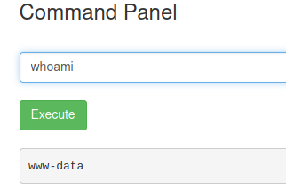
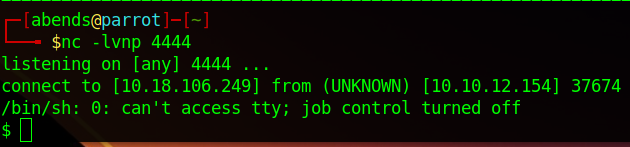

# TryHackMe: Pickle Rick

## Task 1: Pickle Rick
Используем nmap для сканирования машины:
```sh
nmap -sC -sV 10.10.12.154
```


Мы нашли:
- 22 port - SSH (OpenSSH 7.2p2)
- 80 port - HTTP (Apache httpd 2.4.18)

Вариантов у нас в таком случае немного, поэтому переходим на сайт, который располагается на 80 порте:


Присутствует наличие подсказки на использование Burp Suite. Посмотрим, что и как. Перенаправим запрос в Repeater для удобства и посмотрим, что нам вернет исходный запрос:


Находим ник: **R1ckRul3s**, его можно было найти и в инспекторе браузера. Также находим путь, откуда подгружаются файлы (*/assets*):


Перейдем в найденную директорию:


В итоге особо ничего интересного в этой директории нет. Тогда попробуем найти другие директории по самому обычному словарю:
```sh
gobuster dir -u http://10.10.12.154/ -w /usr/share/wordlists/dirb/common.txt
```


Перейдем в *robots.txt*:


Находим какую-то странную строку, но ведь это может являться паролем. Соответственно, есть логин и пароль, попробуем подключиться по SSH:


Дальше мне пришлось достаточно долго искать директории через разные базовые словари. В итоге были найдены две новые директории: */login.php* и */portal.php*
```sh
gobuster dir -u http://10.10.12.154/ -w /usr/share/wordlists/dirbuster/directory-list-lowercase-2.3-medium.txt
```


Переходим на */login.php*:


Попробуем авторизоваться по найденным ранее логину и паролю, и нам это удается!


Видим командную панель. В таком случае пробуем ввести какую-нибудь базовую команду, например, посмотрим файлы в текущей директории:


Видим один из ингридиентов, попробуем прочитать файл:


К сожалению, команда заблокирована. Посмотрим, от какого лица мы находимся в системе:



Мы - **www-data**. Посмотрим, какие команды мы можем выполнять от лица sudo:


На удивление мы можем выполнять абсолютно все команды от лица суперпользователя. Проверим, есть ли доступ к python или python3:


Отлично! Команды исполняются. В таком случае попытаемся получить reverse shell через python3. Для начала на основной системе включаем прослушивание порта, возьмем порт 4444:


Готовые решения можно найти в популярном репозитории PayloadsAllTheThing (https://github.com/swisskyrepo/PayloadsAllTheThings/blob/master/Methodology%20and%20Resources/Reverse%20Shell%20Cheatsheet.md). В шаблон вставляем нужный порт (у нас это 4444) и tun0 IP-адрес:


Применяем команду и получаем желаемое на 4444 порте:



### Question 1: What is the first ingredient Rick needs?
Посмотрим на файлы и прочитаем файл *clue.txt*:


Смотрим файл *Sup3rS3cretPickl3Ingred.txt*:


Первый ингредиент - **mr. meeseek hair**

### Question 2: Whats the second ingredient Rick needs?
Поднимемся в корневую директори и далее перейдем в */home*. Видим двух пользователей - **rick** и **ubuntu**. Посмотрим в папку пользователя *rick*:


Видим файл со вторым ингредиентом. Читаем его:


Второй ингредиент - **1 jerry tear**

### Question 3: Whats the final ingredient Rick needs?
В папку */root* просто так перейти нельзя:


Но мы можем посмотреть внутрь нее при помощи sudo, а также прочитать этот файл тем же методом:


Третий ингредиент - **fleeb juice**

P.S. посмотрел другие способы решения и увидел, что все три ингредиента можно получить не получая reverse shell, например при помощи команды *less* или экранируя какой-либо символ в команде. И да, в исходном коде страницы можно было посмотреть список заблокированных команд:


