# TryHackMe: RootMe

## Task 1: Deploy the machine
:heavy_check_mark: Complited 

## Task 2: Reconnaissance
### Question 1: Scan the machine, how many ports are open? What version of Apache is running? What service is running on port 22?

Используем nmap для сканирования машины:
```sh
nmap -sC -sV 10.10.82.34
```

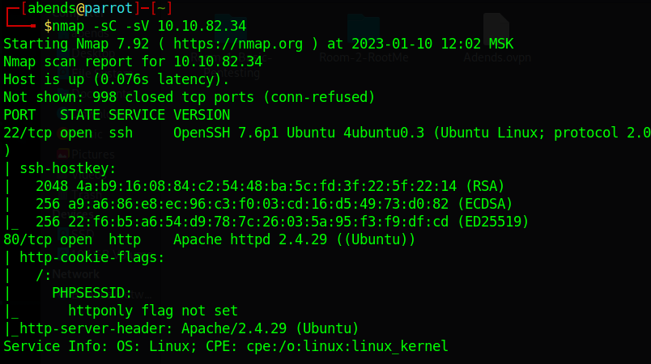

Мы нашли:
- 22 port - SSH (OpenSSH)
- 80 port - HTTP (Apache httpd 2.4.29)

Видим, что открыт HTTP-порт, в таком случае попробуем зайти на сайт:

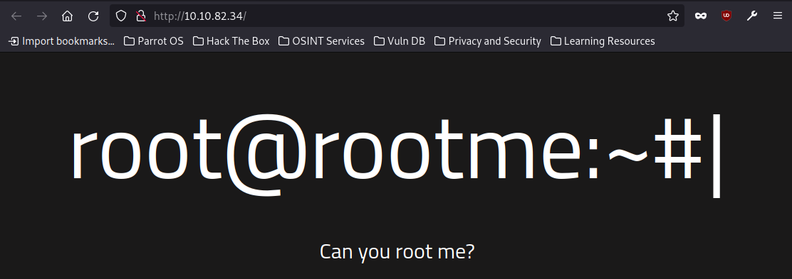

Посмотрев на исходный код страницы, ничего интересного обнаружить не удалось.

Далее с помощью инструмента GoBuster ищем директории ресурса:
```sh
gobuster dir -u http://10.10.82.34/ -w /usr/share/wordlists/dirb/common.txt
```
Результат показан ниже:

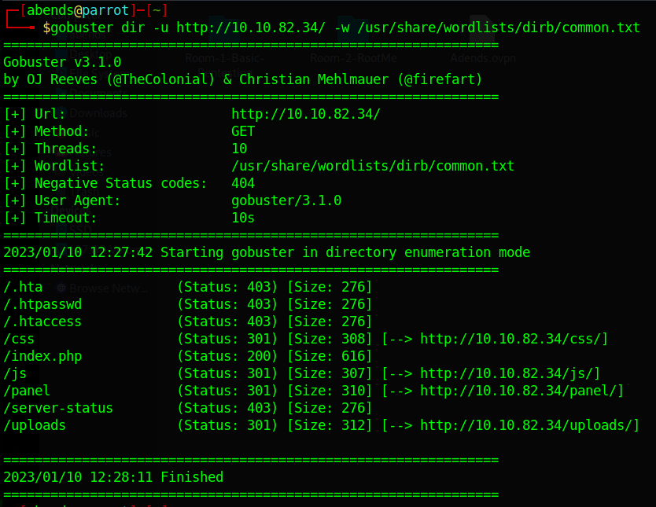

Помимо всего прочего, находим и скрытую директорию */panel/*.

## Task 3: Getting a shell
Переходим в директорию */panel* на сайте и видим форму для загрузки файла:

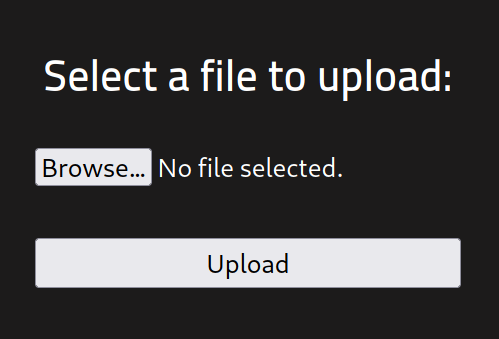

Если попытаемся загрузить какой-нибудь файл, то получим ошибку. Откроем и посмотрим, что нам скажет hint к заданию: Search for "file upload bypass" and "PHP reverse shell".

Если загуглить второй вариант с PHP reverse shell, можно найти ссылку на github с файлом для нужных нам целей (https://github.com/pentestmonkey/php-reverse-shell)

Откроем файл и поменяем в нем некоторые данные, а именно, значения переменных *$ip* и *$port*. 
- *$ip* - пишем наш ip-адрес, который стоит у нас в разделе *tun0*, его можно посмотреть с помощью команды ifconfig или на сайте THM.
- *$port* - устанавливаем порт, который впоследствии будет прослушивать netcat. В моем случае это порт 4444.

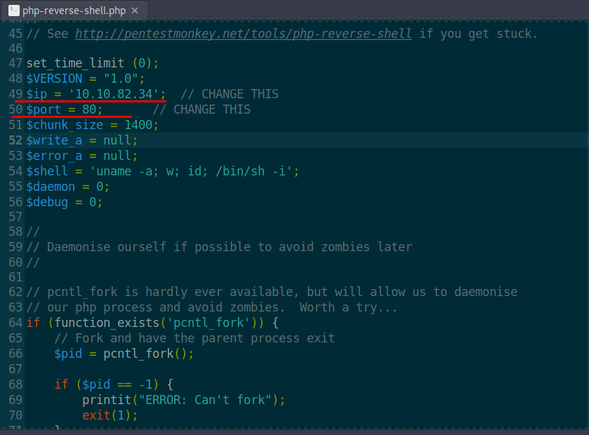

Теперь, попробуем загрузить наш вредоносный файл на сервер при помощи формы в директории */panel*. В результате получаем ошибку - *PHP-файлы не разрешены*

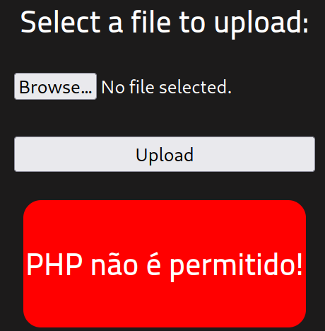

Тут нам на помощь приходит вторая подсказка, поэтому, посмотрев, как происходит обход фильтрации, попробуем некоторые варианты:
1) Поменяем регистр букв в расширении (используем .pHp) - не сработало
2) Попробуем добавить спец. символ в конце (используем .php%20) - успех

Дополнительно варианты можно посмотреть по ссылке: https://book.hacktricks.xyz/pentesting-web/file-upload

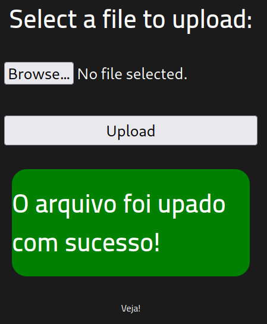

Теперь на вкладке /uploads можно увидеть наш загруженный скрипт:

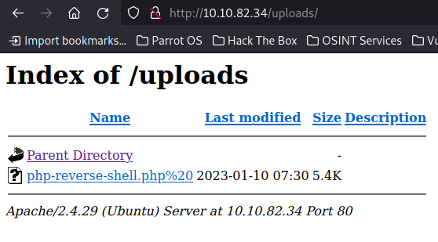

При помощи netcat слушаем порт 4444:
```sh
nc -lvnp 4444
```
Нажимаем на наш скрипт на сайте в разделе /uploads, но получаем ошибку:

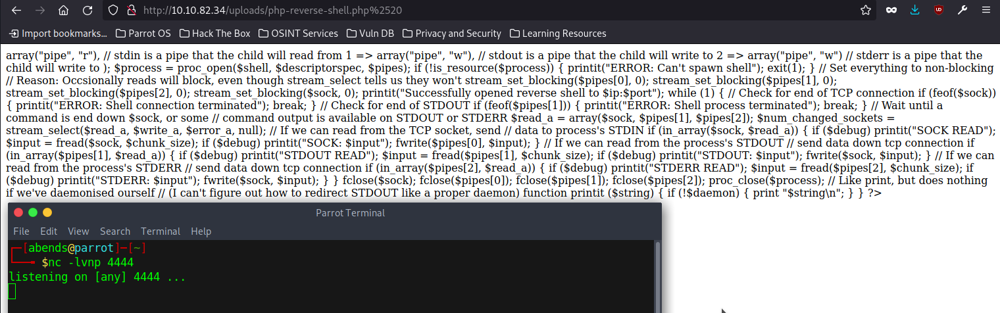

Попробуем загрузить этот же файл с другим расширением (.phtml):

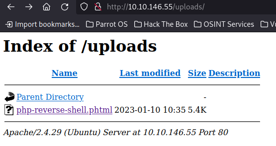

Есть! Мы получили reverse shell! Теперь, необходимо найти флаг. Походив по директориям, можно найти файл user.txt, где и находится флаг к заданию 3. 

Путь до файла: */var/www*
Флаг: *THM{y0u_g0t_a_sh3ll}*

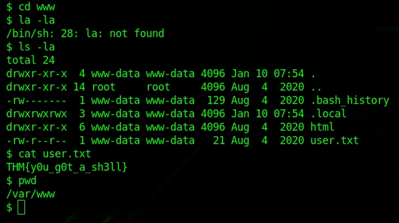

## Task 4: Privilege escalation
Теперь нам необходимо повысить привилегии, но для этого, нужно за что-то "зацепиться".

### Question 2: Search for files with SUID permission, which file is weird?
Попробуем найти файлы/директории, которые УЖЕ доступны суперпользователю:
```sh
find / -user root -perm /4000
```
Из интересного и полезного находим доступ к python:

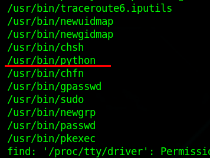

### Question 3: Find a form to escalate your privileges. Read the root.txt to get a flag.
Мы выяснили, что у нас УЖЕ есть доступ к python, но как с помощью него можно повысить привилегии? Попробуем загуглить "python prevesc". По первой ссылке находим ресурс по названием GTFOBins. Далее в поисковой строке вбиваем *python* и смотрим в раздел SUID. 

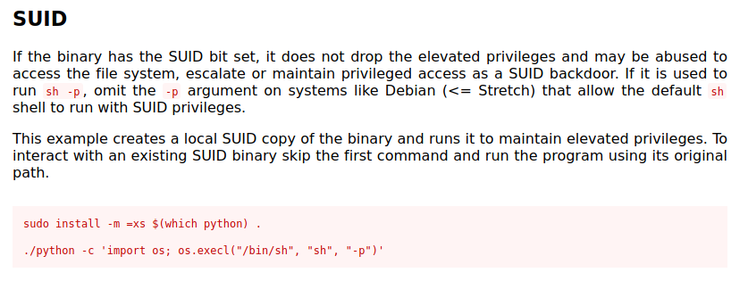

Переходим в директорию /usr/bin:
```sh
cd usr/bin/
```
Нам нужна вторая команда:
```sh
./python -c 'import os; os.execl("/bin/sh", "sh", "-p")'
```
После того, как команда сработала, проверим, кем мы являемся теперь:
```sh
whoami
```
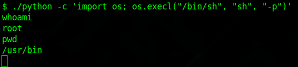

Далее ищем директорию известного нам файла *root.txt*:
```sh
find / -iname root.txt
```
Читаем файл:
```sh
cat /root/root.txt
```
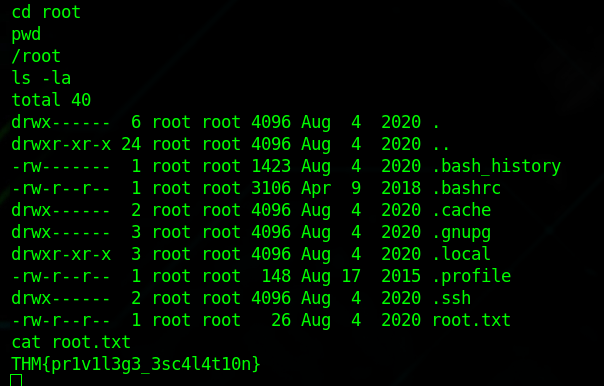

Флаг: *THM{pr1v1l3g3_3sc4l4t10n}*
