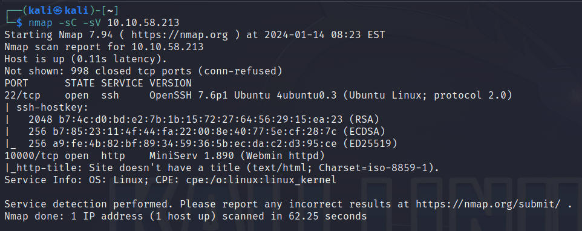
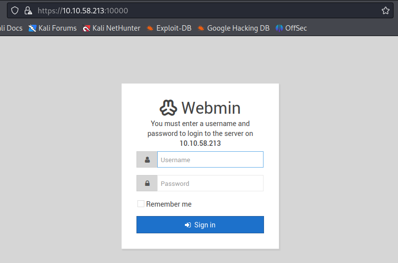
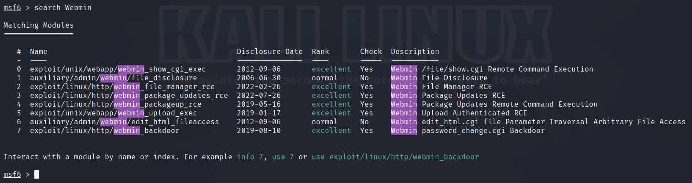
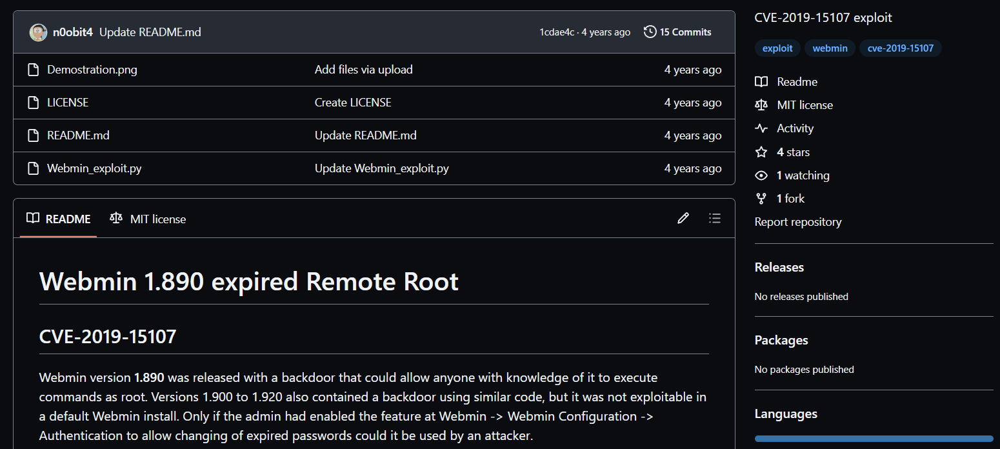
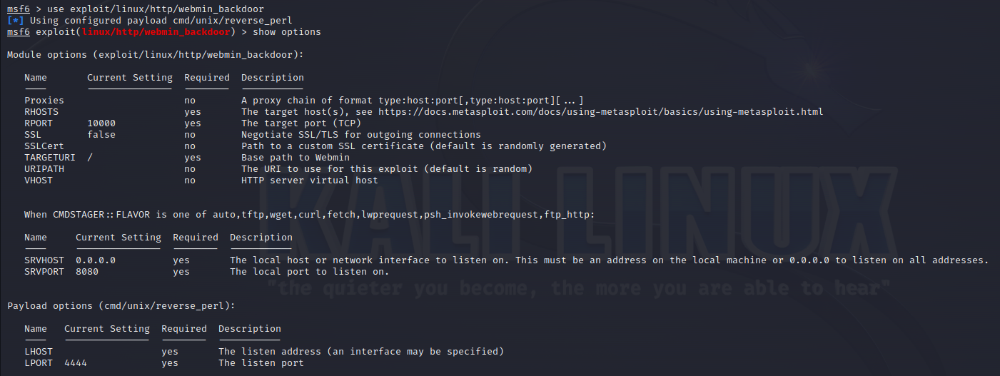
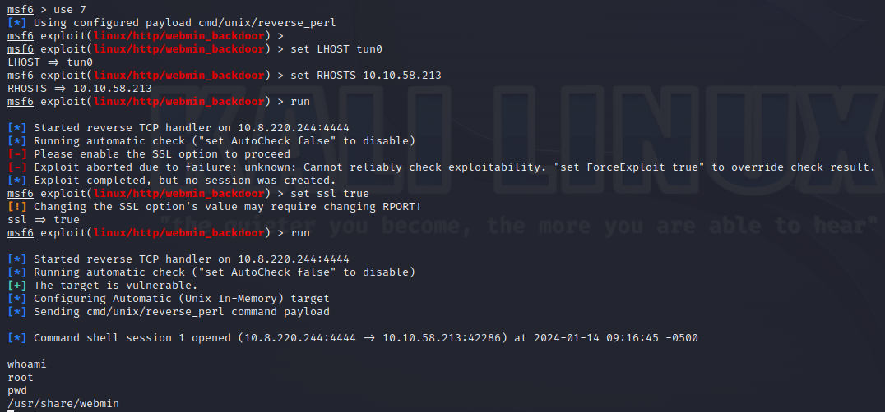
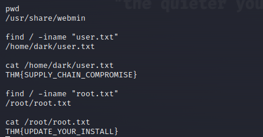

# TryHackMe: Source

---

## Task 1: Embark

Используем Nmap для сканирования машины:

```sh
sudo nmap -sC -sV 10.10.58.213
```



Мы нашли:
- 22 port - SSH (OpenSSH 7.6p1)
- 10000 port - HTTP (MiniServ 1.890)

Панель Webmin:



За неимением данных для входа, посмотрим существующие эксплойты в Metasploit:



Нас интересует Backdoor (CVE-2019-15107) (RCE)



Посмотрим опции:



Реализуем атаку:



Как итог, получаем доступ к системе от root. Остается только прочитать флаги:



### Question 1: user.txt - THM{SUPPLY_CHAIN_COMPROMISE}

### Question 2: root.txt - THM{UPDATE_YOUR_INSTALL}

---
