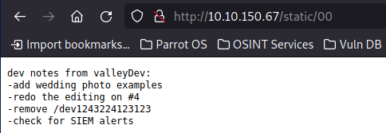
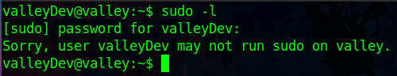

# TryHackMe: Valley

## Task 1: Get those flags!
Используем Nmap для сканирования машины:
```sh
nmap -sC -sV -p- 10.10.150.67
```


Мы нашли:
- 22 port - SSH (OpenSSH 8.2p1)
- 80 port - HTTP (Apache httpd 2.4.41)
- 37370 port - FTP (vsftpd 3.0.3)

Первым делом, перейдем на сайт и осмотрим его:


Осмотрев сайт, находим следующие директории:
- /
- /pricing
- /gallery
- /static (и вложеные директории по номерам фотографий)

В директории **/pricing** присутствует файл **note.txt**:


В записке рекомендуется некому пользователю **J** прекратить размещать записи на веб-ресурсе. Возможно, мы можем найти и другие записи. Попробуем посканировать сайт на наличие других директорий:


Сканирование относительно корневой директории не дало новых результатов в отличие от сканирования относительно директории **/static**:


Найдена интересная директория - **/00**:



В найденной директории располагается еще одна запись, в которой мы находим директорию **/dev1243224123123**:


Обнаруживаем страницу логина, а в исходном коде страницы находим и данные для входа (**siemDev:california**): 


Проходим авторизацию при помощи найденных логина и пароля и попадаем на новую запись:


Обращаем внимание на пункт **stop reusing credentials**, а также на заголовок **dev notes for ftp server**. Пробуем войти на FTP-сервер, используя найденные ранее логин и пароль:


Скачиваем все найденные файлы:


Проверяем скачанные дампы сетевого трафика по порядку, начиная с файла **siemFTP.pcapng**:


В этом файле находим лишь упоминание про вход под анонимным пользователем на FTP-сервер. Собственно, на данный момент эта возможность отключена:


Исследуем файл **siemHTTP1.pcapng**:


Через **экспорт HTTP-объектов** находим ресурсы, с которыми были произведены какие-либо манипуляции со стороны пользователя. Присутствует взаимодействие с необычным сайтом **www.testingmcafeesites.com**, но среди HTTP-объектов, связанных с этим сайтом, ничего интересного найдено не было:


В третьем файле (**siemHTTP2.pcapng**) находим другой интересный ресурс - **192.168.111.136**


Среди HTTP-объектов, связанных с этим ресурсом, находим объект, в котором в открытом виде лежат логин и пароль - **valleyDev:ph0t0s1234**


Попробуем подключится по SSH, учитывая то, что пользователь любит повторять логины и пароли:


У нас это выходит и получаем первый флаг:


### Question 1: What is the user flag? - THM{k@l1_1n_th3_v@lley}

Проверяем доступность к sudo:



Запуск команд с sudo нам недоступен. В таком случае попробуем найти SUID-файлы:

```sh
find / -perm -4000 2>/dev/null
```


Попробовав различные базовые варианты повышения привилегий с найденными командами, не получаем какого-либо результата. Проверим, есть ли какие-то другие пользователи в системе:


Находим не только пользователей, но и файл **valleyAuthenticator**. Скопируем этот файл к себе на машину:


Находим хэш пароля и через **CrackStation** получаем сам пароль - **liberty123**:


Запускаем файл для проверки логина (логин найден в директории **/home**) и пароля:


В итоге, данные для входа следующие - **valley:liberty123**

Осуществляем переход в другую УЗ:


Находим файл с расширением .py (**photosEncrypt.py**) в **crontab**:


Внутри найденного скрипта используется библиотека **base64**. Осуществим переходм в файл с данной библиотекой и пропишем команду, которая позволит нам (пользователю **valley**) исполнить файл **photosEncrypt.py** с разрешениями фладельца файла, а в качестве владельца выступает пользователь **root**:

```sh
os.system('chmod +s /bin/bash')
```


Иными словами мы разрешаем пользователю **valley** исполнить команду **bash** с разрешениями root-пользователя.

Выполним команду **bash -p** и получим доступ от лица root'а:


Остается только прочитать второй флаг:


### Question 2: What is the root flag? - THM{v@lley_0f_th3_sh@d0w_0f_pr1v3sc}
