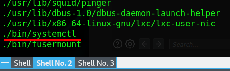

# TryHackMe: Vulnversity

## Task 1: Deploy the machine
:heavy_check_mark: Completed

## Task 2: Reconnaissance
Nmap (Network Mapper) - это набор инструментов для сканирования сети.

Просканируем машину при помощи nmap и ответим на вопросы:
```sh
nmap -sC -sV 10.10.198.13
```


### Question 1: Scan the box, how many ports are open?
Если обратить внимание на скрин выше, то можно заметить, что на машине открыты 6 портов:
- 21 port (FTP)
- 22 port (SSH)
- 139 port (netbios-ssn - 3.X - 4.X)
- 445 port (netbios-ssn - 4.3.11-Ubuntu)
- 3128 port (http-proxy)
- 3333 port (HTTP)
 
### Question 2: What version of the squid proxy is running on the machine?
При указании флага *-sV* nmap будет пытаться узнать версию сервисов, которые располагаются на портах. Соответсвенно, версия squid proxy = 3.5.12

### Question 3: How many ports will nmap scan if the flag -p-400 was used?
Опция *-p* позвоялет задать диапазон портов для проверки, в случае, если указано -p-400 nmap проверит 400 портов (с 1 по 400)

### Question 4: Using the nmap flag -n what will it not resolve?
Если к команде добавить *-n*, то nmap не будет делать разрешение DNS для найденных активных IP-адресов.

### Question 5: What is the most likely operating system this machine is running?
Чтобы узнать, какая операционная система установлена на удаленной машине, можно воспользоваться флагом *-A*. На сканируемой машине в нашем случае установлена Ubuntu.

### Question 6: What port is the web server running on?
На 3333 порте установлен Apache, значит это и есть Web Server.

## Task 3: Locating directories using GoBuster
Gobuster — это инструмент для брут-форса URI (директорий и файлов) в веб-сайтах, DNS субдоменов (с поддержкой подстановочных символов), имён виртуальных хостов на целевых веб-серверах. Попробуем найти скрытыте директории на сайте  при помощи gobuster:
```sh
gobuster dir -u http://10.10.198.13:3333 -w /usr/share/wordlists/dirbuster/directory-list-2.3-samll.txt
```
- *dir* - перебираем директории;
- *-u* - адрес назначения (target);
- *-w* - словарь директорий.


### Question 7: What is the directory that has an upload form page?
Нам удалось найти скрытую директорию */internal*, на которой располагается форма загрузки:


## Task 4: Compromise the webserver
### Question 8: What common file type, which you'd want to upload to exploit the server, is blocked? Try a couple to find out. 
Перейдя в */internal* пробуем загрузить файлы с различными расширениямм. В конечно итоге устанавливаем, что *.php* загрузить нельзя. Чтобы проверить множество вариантов, не загружая каждый раз разные файлы, можно использовать *Intruder* в *Burp Suite*.

Burp Suite - это интегрированная платформа для тестирования безопасности веб-приложений.

Для начала откроем программу и включим "Intercept is on". Далее в браузере (Chromium) переходим по адресу http://10.10.198.13:3333/internal и попробуем загрузить какой-то файл, например, excel-файл и посмотрим, что у нас появилось в захваченном запросе:


Теперь нажмем правой кнопкой мыши и отправим запрос в *Intruder* (Send to Intruder) и обратим внимание на две выделенные строки и данные самого файла. Модернизируем запрос:


Перейдем во вкладку *Payloads* и введем свой словарь значений:


Далее перейдем во вкладку *Options* и введем *Success* во флаги + поставим соответствующую галочку:


После всех вышеописанных подготовительных действий, запускаем атаку и смотрим, чтобы в разделе *Success* была *1*:


Тем самым, находим одно из доступных php-расширений - *.phtml* (**Question 9**)

Теперь качаем файл для получения реверс-шелла, который написан на *PHP* (https://github.com/pentestmonkey/php-reverse-shell/blob/master/php-reverse-shell.php)

Меняем параметры:
- $ip = "10.18.106.249" - IP-адрес из *tun0* (чтобы узнать, необходимо ввести ifconfig)
- $port = 4444;


Меняем расширение на *.phtml* и загружаем файл через форму загрузки:


Переходим во вкладку */uploads*, видим загруженный скрипт:


Отлично, теперь в отдельной консоли вводим команду для прослушивание порта 4444 и нажимаем на скрипт в */uploads*:
```sh
nс -lvnp 4444
```


### Question 10 and 11: What is the name of the user who manages the webserver? What is the user flag?
Находим на сервере папку пользователя *bill*, в которой находится и флаг пользователя (user flag):


## Task 5: Privilege Escalation
### Question 12: On the system, search for all SUID files. What file stands out?
Введем команду для поиска SUID файлов:
```sh
find / -user root -perm -4000 -exec ls -ldb {} \;
```

И среди всего прочего находим **/bin/systemctl**:



Попробуем найти prevesc на GTFOBins для *systemctl*:


Пробуем воспользоваться и получаем root flag:


