# TryHackMe: Wgel CTF

## Task 1: Wgel CTF

Используем nmap для сканирования машины:
```sh
nmap -sC -sV 10.10.145.87
```
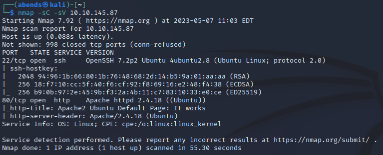

Мы нашли:
- 22 port - SSH (OpenSSH 7.2p2) 
- 80 port - HTTP (Apache httpd 2.4.18)

Перейдем на сайт:

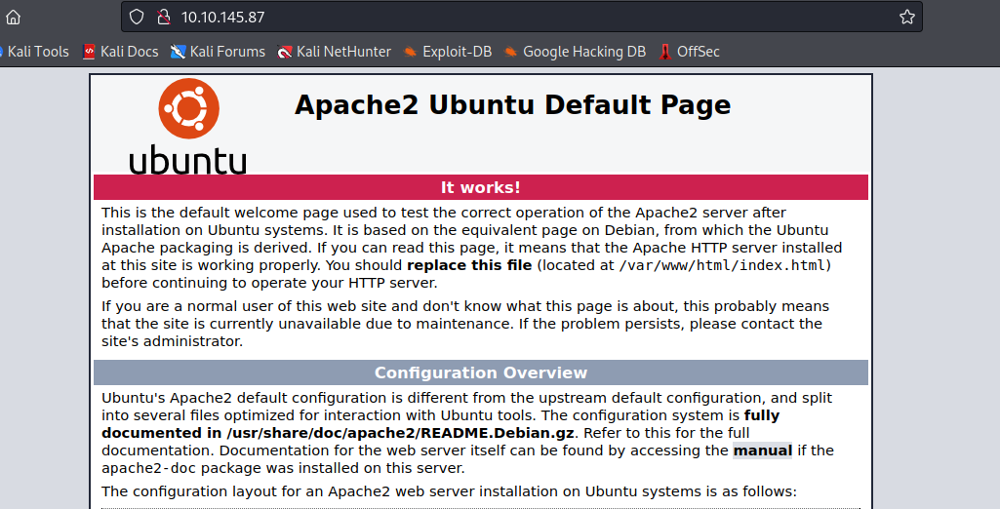

Попробуем найти другие директории сайта:
```sh
gobuster dir -u http://10.10.145.87/ -w /usr/share/wordlists/dirbuster/directory-list-2.3-medium.txt
```

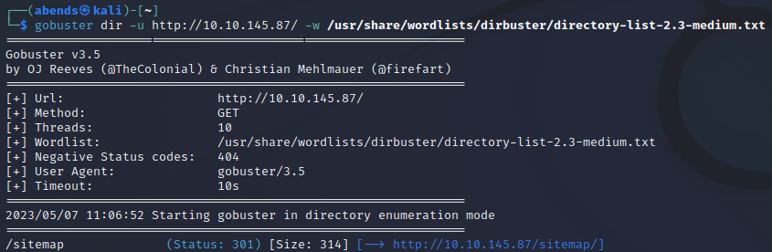

Находим директорию **/sitemap**:

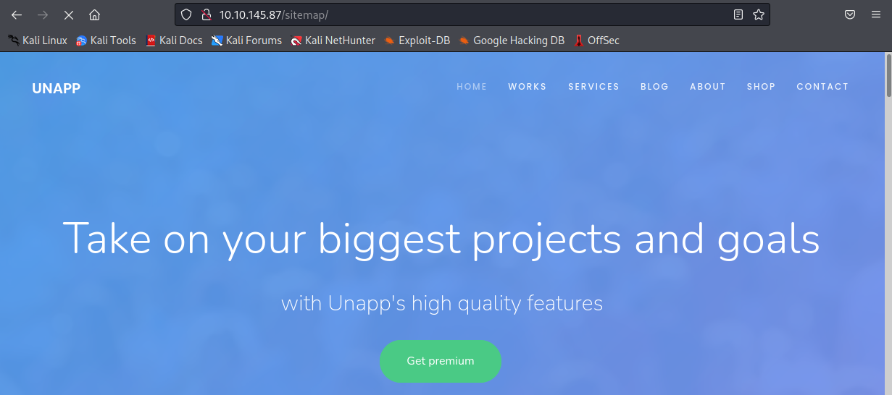

На сайте ничего интересного найдено не было, поэтому попробуем найти другие директории относительно найденной до этого:
```sh
gobuster dir -u http://10.10.145.87/sitemap -w /usr/share/wordlists/dirb/common.txt -x php,html,txt
```

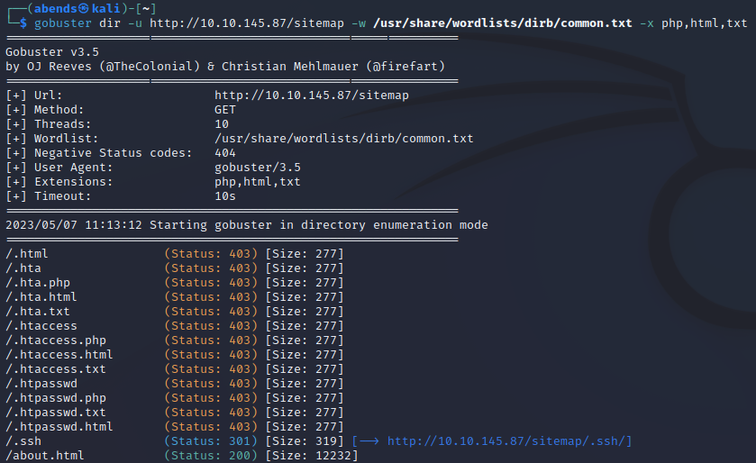

Перейдем в директорию **/.ssh**:

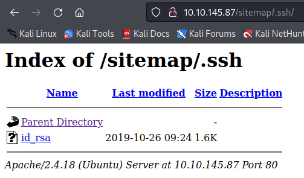

Находим приватный RSA-ключ:

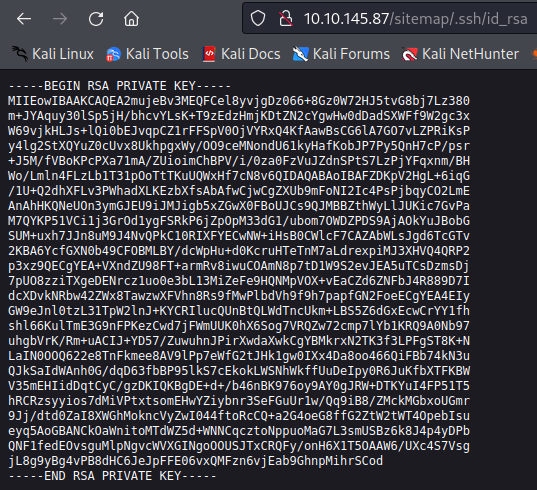

Копируем его в файл:

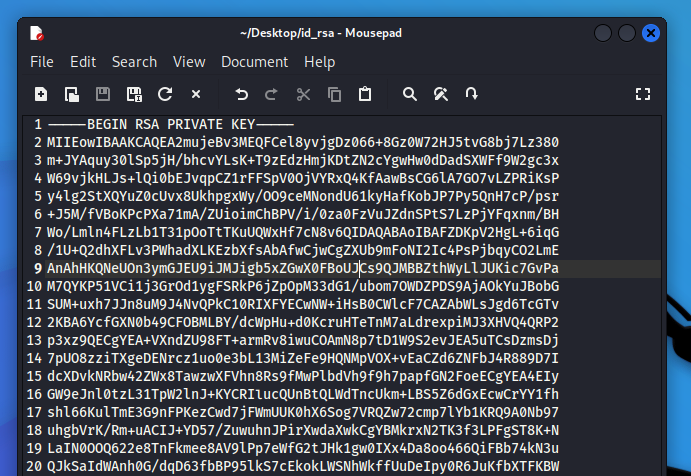

Мы нашли ключ, а логин пользователя нам неизвестен. Ищем его среди директорий. Находим логин **jessie** в Apache Default Page.

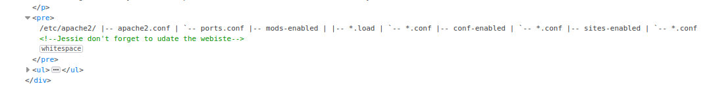

Присваиваем нужные права файлу и подключаемся по SSH:

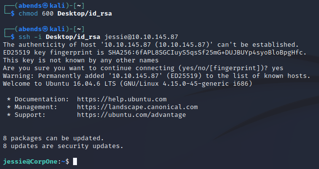

Находим первый флаг:

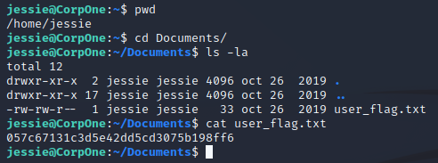

### Question 1: User flag - 057c67131c3d5e42dd5cd3075b198ff6

Посмотрим, с чем мы можем взаимодействовать, используя sudo:

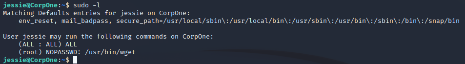

Находим команду **wget**. Посмотрим на GTFORBins:

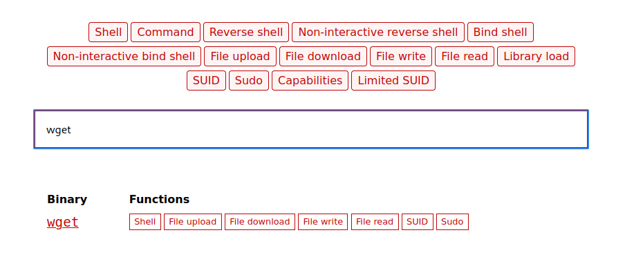

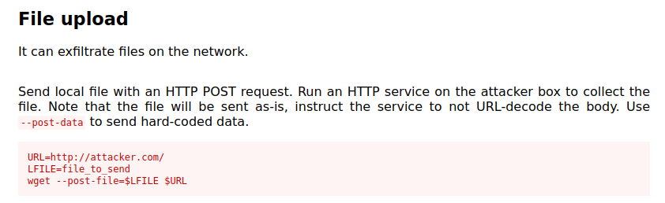

Чтобы получить файл, включим прослушивание порта, причем именно 80 - передача проходит по протоколу HTTP:

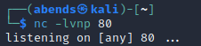

Передаем файл **/etc/passwd**:

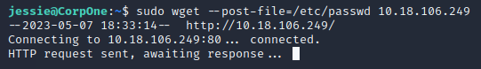

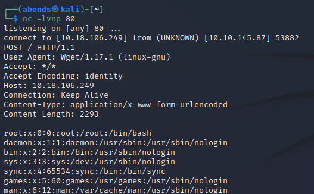

Сохраним содержимое в отдельный файл с названием **passwd** (чтобы потом заменить этот файл на взламываемой машине):

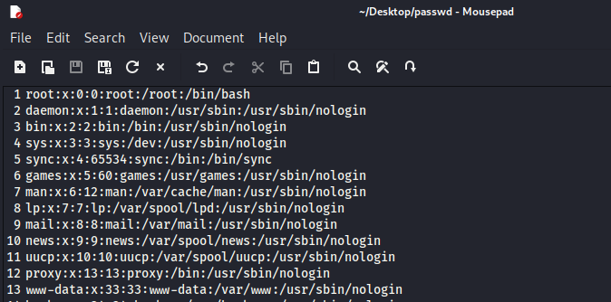

Создадим пароль, причем зашифрованный:

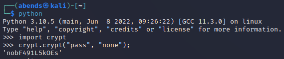

Вставим созданный пароль в созданный файл:

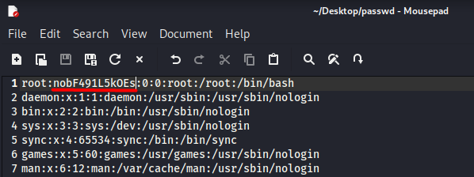

Откроем порт 8080 посредством http.server:

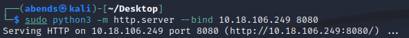

Заменим файл на удаленной машине:

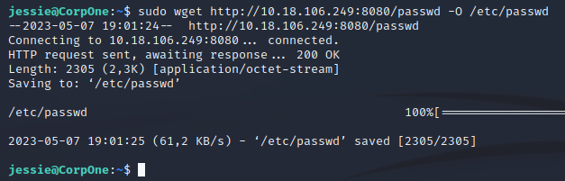

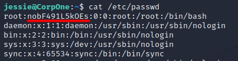

Теперь мы можем перейти в root-пользователя, используя пароль, хэш которого мы внесли в файл:

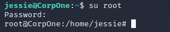

Находим root-флаг:

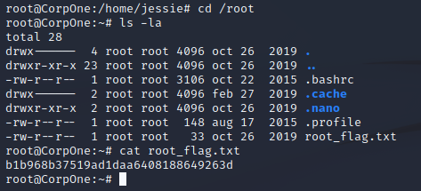

### Question 2: Root flag - b1b968b37519ad1daa6408188649263d
