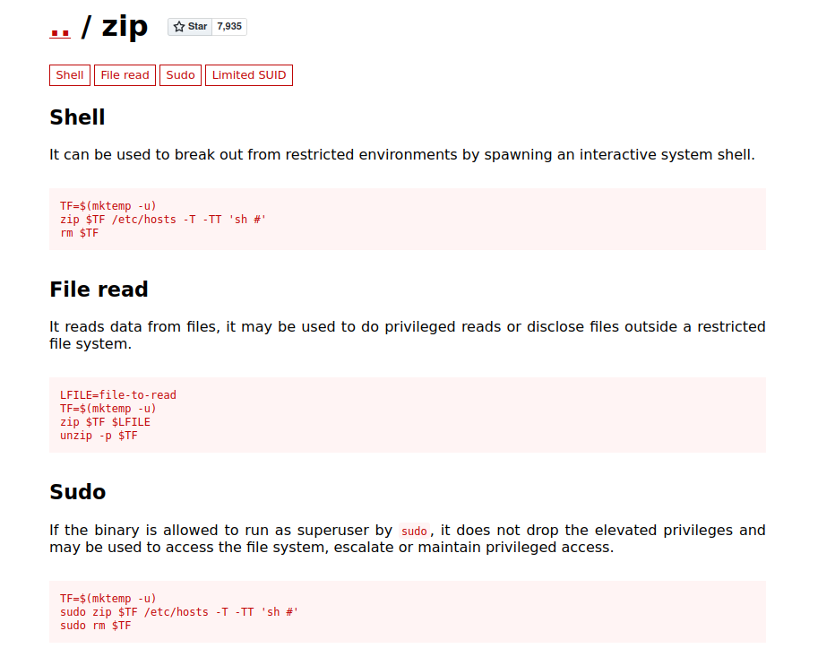

# TryHackMe: tomghost

## Task 1: Flags
### Question 1: Compromise this machine and obtain user.txt
Для начала произведем разведку портов атакуемой машины:
```sh
nmap -sC -sV 10.10.124.86
```


Найденные порты:
- 22 port - SSH (OpenSSH 7.2p2)
- 53 port - tcpwrapped
- 541 port - uucp-rlogin
- 8009 port - ajp13 (Apache Jserv (Protocol v1.3))
- 8080 port - http (Apache Tomcat 9.0.30)

Посомтрим, что у нас находится на стороне http-порта:


Далее была найдена информация о **CVE-2020-1983 - Apache Tomcat - AJP 'Ghostcat File Read/Inclusion'** на ExploitDB:


Можно скачать эксплойт на этом же сайте, но я предпочту посмотреть на версию с github:


Теперь немного притормозим и окунемся немного в теорию. **Apache JServ Protocol (AJP)** — это бинарный протокол, созданный ради избавления от избыточности HTTP. AJP обычно используется для балансировки нагрузки, когда один или несколько внешних веб-серверов (front-end) отправляют запросы на сервер (или серверы) приложений. В данном случае у нас AJP протокол работает на 8009 порту. Собственно, сама уязвимость позволяет злоумышленнику читать произвольные файлы на целевой системе внутри директории appBase. Реализация протокола AJP (Apache JServ Protocol) позволяет контролировать атрибуты, которые отвечают за формирование пути до запрашиваемых файлов. Специально сформированный запрос на сервер позволяет прочитать содержимое файлов, доступ к которым невозможен в других условиях. Если можно загрузить файл на сервер, существует риск использования уязвимости для выполнения произвольного кода.
Запускаем скачанный ранее эксплойт:


Как видим, мы получили данные для входа. Попробуем в таком случаем подключиться по SSH:


Посмотрим, кто мы и где находимся:


Из интересного можно увидеть два файла:
- credential.pgp
- tryhackme.asc

К ним мы вернемся чуть позже, а пока что проверим, какие команды мы можем выполнять от лица sudo-пользователя:


И тут мы обнаруживаем, что ничего не можем делать(
Так, поднимемся на директорию выше и посмотрим, чьи папки находится там:


В системе обнаруживаем еще одного пользователя - merlin. Перейдем в его папку и посмотрим файлы:


А вот и первый флаг! - *THM{GhostCat_1s_so_cr4sy}*

### Question 2: Escalate privileges and obtain root.txt
Раз у нас нет возможности использовать команды от лица sudo, скорее всего нам надо зайти через пользователя merlin. Вспоминаем про файлы, которые мы наши у skyfuck. Перекинем эти файлы к себе на систему. При помощи netcat слушаем 443 порт, а с атакуемой машины осуществляем подключение с переносом файла.


*Те же операции проделываем и для второго файла!*

**PGP (Pretty Good Privacy / «Достаточно надежная конфиденциальность»)** - это программа шифрования с публичным ключом, которая стала самым популярным стандартом для шифрования электронных писем. Фраза «Достаточно надежная» – это ироничное преуменьшение. Помимо шифрования и дешифрования электронной почты, PGP используется для подписи сообщений, чтобы получатель мог верифицировать как личность отправителя, так и целостность содержимого.
С помощью gpg2john формируем хэш из файла *tryhackme.asc*:
```sh
gpg2john tryhackme.asc > hash.txt
```


Далее расшифровываем пароль:
```sh
john hash.txt --wordlist=/usr/share/wordlists/rockyou.txt
```


Полученный пароль - alexandru
Далее при помощи утилиты gpg импортируем ключ, при помощи которого эта утилита и будет производить дешифрование (на этом этапе запрашивается пароль, который мы нашли ранее):
```sh
gpg --import tryhackme.asc
```


Дешифруем:
```sh
gpg --decrypt credential.pgp
```


Теперь у нас есть данные от аккаунта *merlin*. Входим по SSH:


Проверяем, какие команды мы можем выполнять в качестве sudo:


Видим **zip**. Переходим на GTFORBins:



Выполняем последовательно команды


Теперь у нас есть доступ к root! Ищем флаг:


Root-флаг - *THM{Z1P_1S_FAKE}*
